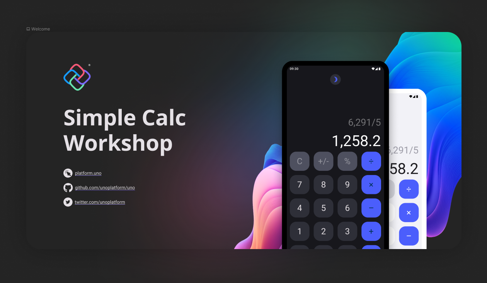
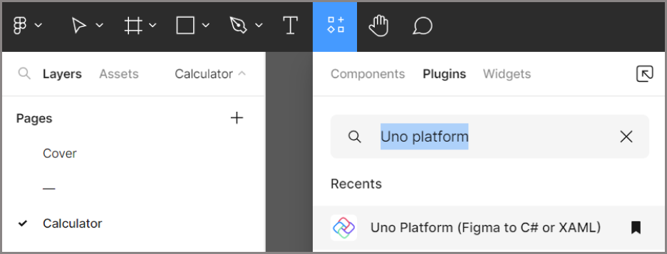
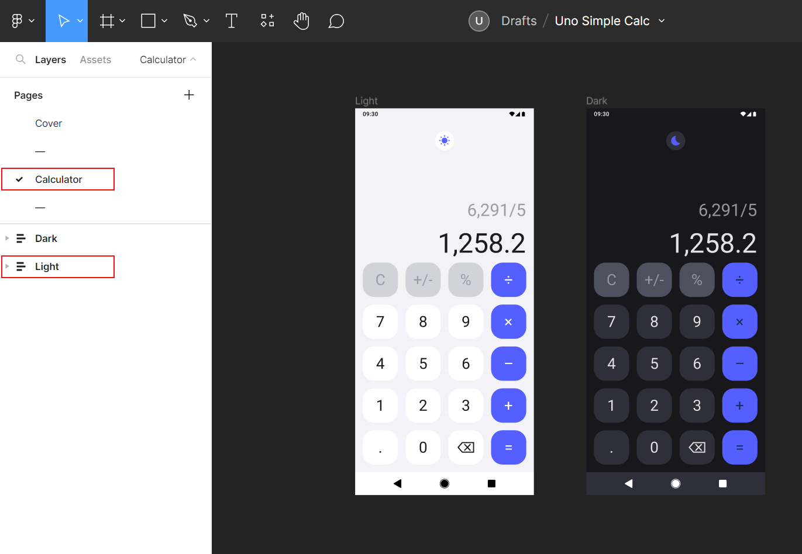

# Importing UI from Figma

In this module, you will learn how to import the UI from Figma.  
Figma is a collaborative app UI design tool that allows users to create, share, and comment on designs in real-time. It then allows exporting the UI in selected markup language for developers to carry on with the pre-designed app.

Uno Platform offers a Figma plugin that enables exporting the UI designed in Figma as both XAML and C# Markup.
In this module, you'll learn how to export the UI from a pre-existing Figma design for the SimpleCalculator app, and how to import it into the app you've started to create in the previous modules.

## Opening the Figma file and setting up an account

1. Use [this link](https://aka.platform.uno/uno-figma-simplecalc-workshop) to access the Figma file for the Simple Calculator project. The link will take you to the Simple Calculator community file, where you can proceed to open it in Figma.

> [!NOTE]
> If you are not currently signed in to Figma, you will be prompted to do so. If you don't have an account, you can create one by following the instructions to sign up with your Google account or using a username and password.

    

## Installing the Uno Platform plugin for Figma

1. The SimpleCalculator file will open in Figma, displaying the Cover page. To export the generated code from the Simple Calculator UI, you'll need to install the Uno Platform plugin. 

   

1. From within the Simple Calculator Figma file, navigate to the "Resources" tab, and under plugins, search for "Uno Platform (Figma to C# and XAML).

    

1. Install the plugin by clicking "Run" or "Try it out” from the community page.

    

## Exporting the UI

1. In the left-side navigation bar, locate the Simple Calculator UI design by selecting the *Calculator* page, and within the layers, choose either the *Dark* or *Light* version.

