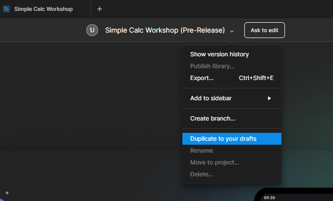
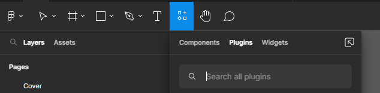

# Importing UI from Figma

In this module, you will learn how to import the UI from Figma.  
Figma is a collaborative app UI design tool that allows users to create, share, and comment on designs in real time. It then allows exporting the UI in selected markup language for developers to carry on with the pre-designed app.

Uno Platform offers a Figma plugin that enables exporting the UI designed in Figma as both XAML and C# Markup.
In this module, you'll learn how to export the UI from a pre-existing Figma design for the SimpleCalculator app, how to import it into the app you've started to create in the previous modules.

## Open the Figma file and set up an account

1. Open the SimpleCalculator Figma file via [this link](https://aka.platform.uno/uno-figma-simplecalc-workshop).

1. If you are not signed in with Figma, you will be asked to do so. Create an account if you don't have one. Follow the instructions to sign up with your Google account or use a username and password.

    

## Install the Uno Platform plugin for Figma

1. The SimpleCalculator design will open in Figma, displaying the Cover page:

   

1. To export the UI from Figma, you'll need to install the Uno Platform plugin. To enable that you will need to create your own copy of the SimpleCalculator design.  
    In the top menu in the center of the screen click the little down arrow and select *Duplicate to your drafts* from the menu.

   

1. The duplicated file will open in a new tab and additional menu items and controls will appear on the Figma ribbon.

    

1. In the search box enter "Uno Platform (Figma-To-XAML)". Launch the plugin by clicking the Uno Platform plugin.

    

## Export the UI

1. The page designed in the SimpleCalculator design in Figma is listed in the left-side navigation bar. Select **Simple Calculator design**, then select **Simple Calc** (either Dark or Light version) option that appears at the bottom of the sidebar.

