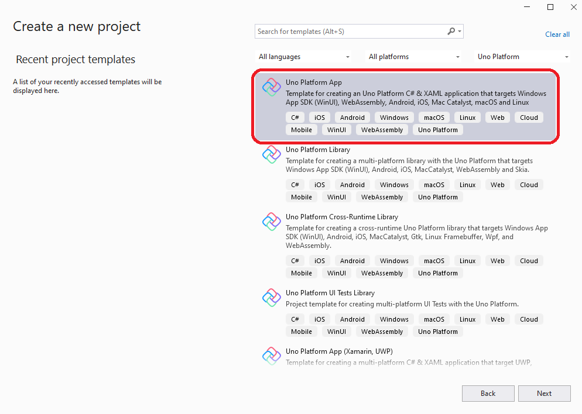
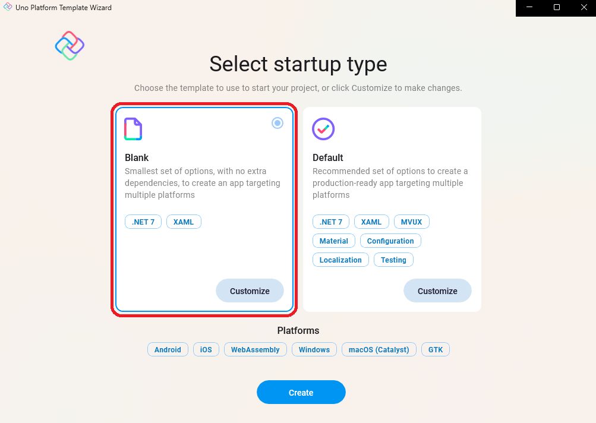
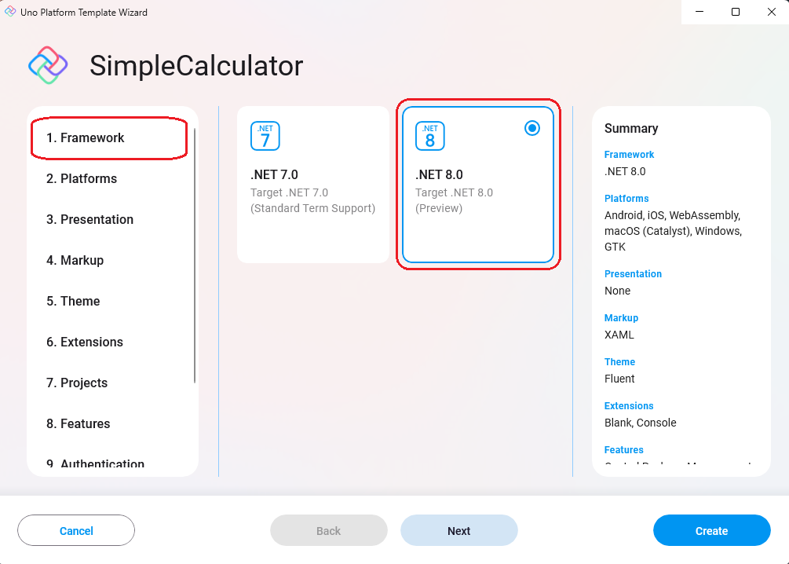
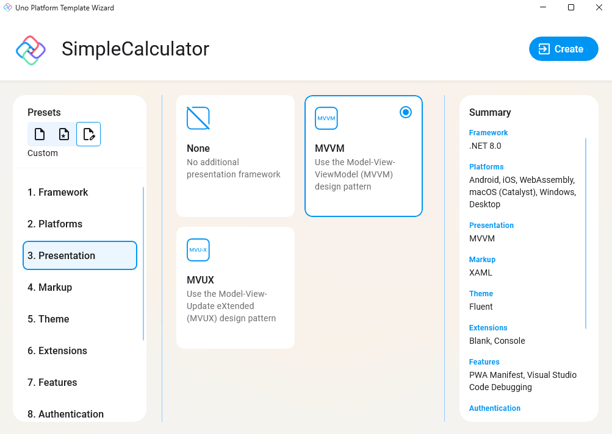
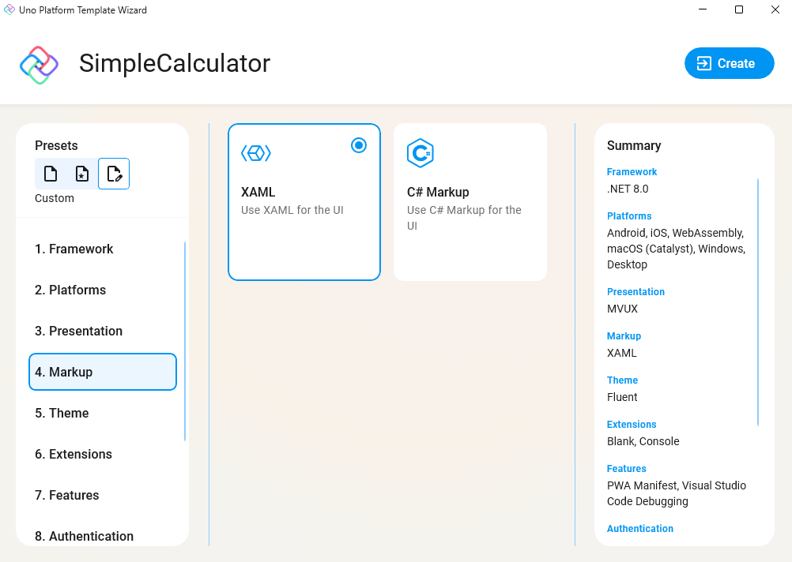
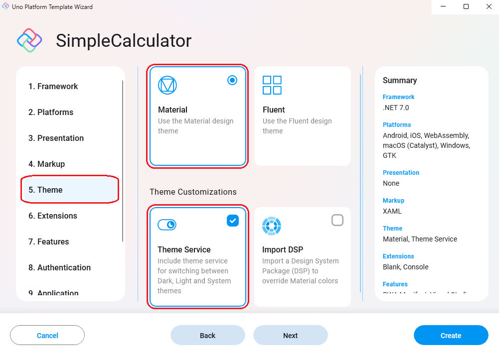

Open Visual Studio and click on "Create a new project". In the "New Project" window, select "Uno Platform App" from the list of templates.

<picture>
  <source media="(prefers-color-scheme: dark)" srcset="../../../art/Dark/Wizard/1.template.png">
  <source media="(prefers-color-scheme: light)" srcset="../../../art/Light//Wizard/1.template.png">
  
</picture>

Name your app "SimpleCalculator" and choose the folder where you want to save your project.

<picture>
  <source media="(prefers-color-scheme: dark)" srcset="../../../art/Dark/Wizard/2.naming.png">
  <source media="(prefers-color-scheme: light)" srcset="../../../art/Light//Wizard/2.naming.png">
  
</picture>

In the new Wizard, you'll be prompted to select a preset configuration for your application. The "Default" preset allows you to take advantage of features such as the Material library, the Toolkit, Extensions for Navigation and MVUX, and more. For the moment we’re going to select the "Blank" option.

<picture>
  <source media="(prefers-color-scheme: dark)" srcset="../../../art/Dark/Wizard/3.startup.png">
  <source media="(prefers-color-scheme: light)" srcset="../../../art/Light//Wizard/3.startup.png">
  
</picture>

In the first menu option "Framework", let's select **.NET8**.

<picture>
  <source media="(prefers-color-scheme: dark)" srcset="../../../art/Dark/Wizard/framework.png">
  <source media="(prefers-color-scheme: light)" srcset="../../../art/Light//Wizard/framework.png">
  
</picture>

Select "Customize" from the left menu. Then, select "3. Presentation" and choose the **MVVM** pattern.

<picture>
  <source media="(prefers-color-scheme: dark)" srcset="../../../art/Dark/Wizard/4.Presentation-MVVM.png">
  <source media="(prefers-color-scheme: light)" srcset="../../../art/Light//Wizard/4.Presentation-MVVM.png">
  
</picture>

> To know more about MVUX follow the [MVUX Overview](https://platform.uno/docs/articles/external/uno.extensions/doc/Overview/Reactive/overview.html) docs.

Now, let's move to the "4. Markup" menu option and choose **XAML** for your UI.

<picture>
  <source media="(prefers-color-scheme: dark)" srcset="../../../art/Dark/Wizard/5.Markup-XAML.png">
  <source media="(prefers-color-scheme: light)" srcset="../../../art/Light//Wizard/5.Markup-XAML.png">
  
</picture>

Next, let's select the Material library for our app theme. Click on "5. Theme" from the left menu and select "Material", then under the Theme Customizations section select "Theme Service" to have access to theme switching between Dark and Light feature.

<picture>
  <source media="(prefers-color-scheme: dark)" srcset="../../../art/Dark/Wizard/6.theme.png">
  <source media="(prefers-color-scheme: light)" srcset="../../../art/Light//Wizard/6.theme.png">
  
</picture>

> To know more about Themes in Uno follow the [Themes Overview](https://platform.uno/docs/articles/external/uno.themes/doc/themes-overview.html) docs.

Next, let's move to the "8. Features" menu option, and select the "Toolkit" option for the helper functions to switch themes

<picture>
  <source media="(prefers-color-scheme: dark)" srcset="../../../art/Dark/Wizard/7.toolkit.png">
  <source media="(prefers-color-scheme: light)" srcset="../../../art/Light//Wizard/7.toolkit.png">
  
</picture>

> To know more about Uno Toolkit follow the [Getting Started with Uno Toolkit](https://platform.uno/docs/articles/external/uno.toolkit.ui/doc/getting-started.html) docs.

 Finally, click on the "Create" button to finish.