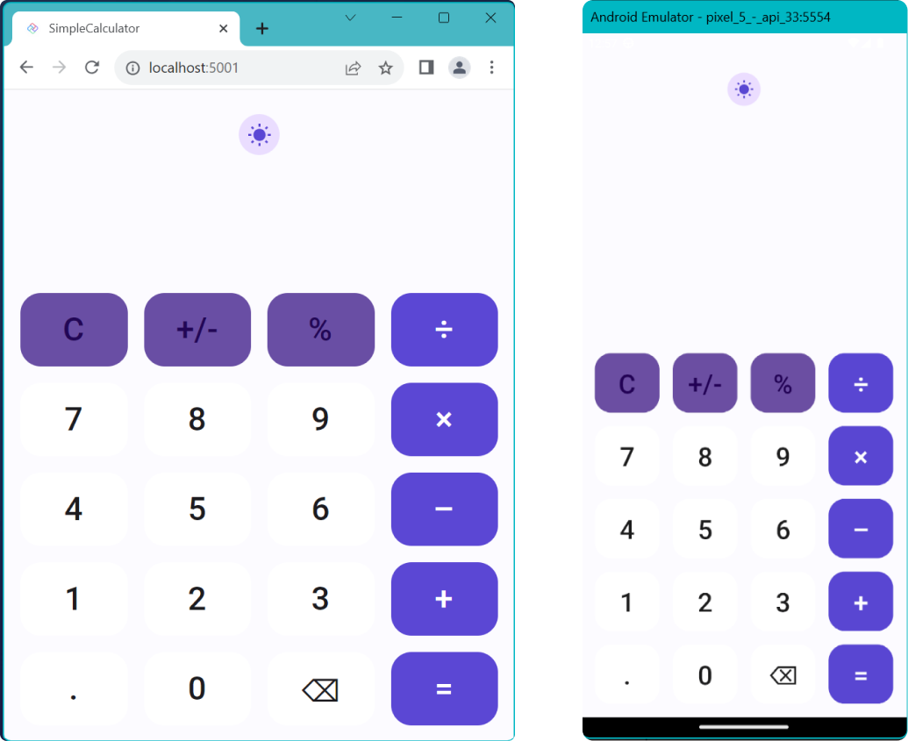

# Creating the Layout

As we start we will want to create a new C# class file. We will use this to hold only resources that we want to create and use in our app. We will call this AppIcons and add the icons to it like:

```cs
public static class AppIcons
{
    public static readonly Resource<Geometry> Dark =
        StaticResource.Create<Geometry>("MoonIcon", "F1 M 3 0 C 1.9500000476837158 0 0.949999988079071 0.1600000262260437 0 0.46000003814697266 C 4.059999942779541 1.7300000190734863 7 5.519999980926514 7 10 C 7 14.480000019073486 4.059999942779541 18.27000093460083 0 19.540000915527344 C 0.949999988079071 19.840000927448273 1.9500000476837158 20 3 20 C 8.519999980926514 20 13 15.519999980926514 13 10 C 13 4.480000019073486 8.519999980926514 0 3 0 Z");

    public static readonly Resource<Geometry> Light =
        StaticResource.Create<Geometry>("SunIcon", "F1 M 5.760000228881836 4.289999961853027 L 3.9600000381469727 2.5 L 2.549999952316284 3.9100000858306885 L 4.340000152587891 5.699999809265137 L 5.760000228881836 4.289999961853027 Z M 3 9.949999809265137 L 0 9.949999809265137 L 0 11.949999809265137 L 3 11.949999809265137 L 3 9.949999809265137 Z M 12 0 L 10 0 L 10 2.950000047683716 L 12 2.950000047683716 L 12 0 L 12 0 Z M 19.450000762939453 3.9100000858306885 L 18.040000915527344 2.5 L 16.25 4.289999961853027 L 17.65999984741211 5.699999809265137 L 19.450000762939453 3.9100000858306885 Z M 16.239999771118164 17.610000610351562 L 18.030000686645508 19.40999984741211 L 19.440000534057617 18 L 17.639999389648438 16.21000099182129 L 16.239999771118164 17.610000610351562 Z M 19 9.949999809265137 L 19 11.949999809265137 L 22 11.949999809265137 L 22 9.949999809265137 L 19 9.949999809265137 Z M 11 4.949999809265137 C 7.690000057220459 4.949999809265137 5 7.639999866485596 5 10.949999809265137 C 5 14.259999752044678 7.690000057220459 16.950000762939453 11 16.950000762939453 C 14.309999942779541 16.950000762939453 17 14.259999752044678 17 10.949999809265137 C 17 7.639999866485596 14.309999942779541 4.949999809265137 11 4.949999809265137 Z M 10 21.900001525878906 L 12 21.900001525878906 L 12 18.950000762939453 L 10 18.950000762939453 L 10 21.900001525878906 Z M 2.549999952316284 17.990001678466797 L 3.9600000381469727 19.400001525878906 L 5.75 17.600000381469727 L 4.340000152587891 16.190000534057617 L 2.549999952316284 17.990001678466797 Z");
}
```

With the resources defined, we need to add them to the Page resources in MainPage.cs.

```cs
public sealed partial class MainPage : Page
{
    public MainPage()
    {
        this.Resources(r => r
                .Add(AppIcons.Dark)
                .Add(AppIcons.Light));
    }
}
```

Next, we will set the page background to use the default background brush, which is a theme resource, meaning that it will adapt to the currently selected theme (dark or light) for the app.

```cs
public sealed partial class MainPage : Page
{
    public MainPage()
    {
        this.Resources(r => r
                .Add(AppIcons.Dark)
                .Add(AppIcons.Light))
            .Background(Theme.Brushes.Background.Default);
    }
}
```

Now we're ready to begin building the content of the page. For this will use a temporary placeholder for the DataContext, as this will be covered later in the Architecture module. Add the following `TempDataContext` class:

```cs
public class TempDataContext
{
    public bool IsDark { get; set; }
    public ICommand? InputCommand { get; set; }
    public Calculator Calculator { get; } = new Calculator();
}
```

The layout will use the `DataContext` extension with a new instance of the `TempDataContext` class and create a `Grid` inside a `Border` that will contain 3 children. Each of the 3 children we will populate from a helper method to keep the code cleaner.

```cs
public sealed partial class MainPage : Page
{
    public MainPage()
    {
        this.Resources(r => r
                .Add(AppIcons.Dark)
                .Add(AppIcons.Light))
            .Background(Theme.Brushes.Background.Default)
            .DataContext(new TempDataContext(), (page, vm) => page
                .Content(
				new Border()
                    .SafeArea(SafeArea.InsetMask.VisibleBounds)
					.Background(Theme.Brushes.Secondary.Container.Default)
				.Child
				(
					new Grid()
					.RowDefinitions<Grid>("Auto,*,Auto,Auto")
					.MaxWidth(700)
					.VerticalAlignment(VerticalAlignment.Stretch)
					.Children
					(
						Header(vm),
						Output(vm),
						Keypad(vm)
					)
				))
            );
    }

    private static UIElement Header(TempDataContext vm) =>
        new TextBlock().Text("Header");

    private static UIElement Output(TempDataContext vm) =>
        new TextBlock().Text("Output");

    private static UIElement Keypad(TempDataContext vm) =>
        new TextBlock().Text("Keypad");
}
```

Now that we have the basic scaffolding let's begin by creating the Header. As we get ready to introduce our first DataBinding it is important to take note that Binding Expressions must, by design, be stateless. This means that the model property in our lambda expression will *ALWAYS* have a null value. Attempting to access instance values from the model will result in a NullReferenceException.

Replace the placeholder `Header` method with the following:

```cs
private static UIElement Header(TempDataContext vm) =>
    new ToggleButton()
        .Grid(row: 0)
        .Margin(8,24,8,0)
        .CornerRadius(20)
        .VerticalAlignment(VerticalAlignment.Top)
        .HorizontalAlignment(HorizontalAlignment.Center)
        .Background(Theme.Brushes.Secondary.Container.Default)
        .Style(Theme.ToggleButton.Styles.Icon)
        .IsChecked(x => x.Binding(() => vm.IsDark).TwoWay())
        .Content
        (
            new PathIcon()
                .Data(AppIcons.Light)
                .Foreground(Theme.Brushes.Primary.Default)
        )
        .ControlExtensions
        (
            alternateContent:
            new PathIcon()
                .Data(AppIcons.Dark)
                .Foreground(Theme.Brushes.Primary.Default)
        );
```

Replace the placeholder `Output` method with the following:

```cs
private static UIElement Output(TempDataContext vm) =>
    new StackPanel()
        .Grid(row: 2)
        .Spacing(16)
        .Padding(16, 8)
        .HorizontalAlignment(HorizontalAlignment.Stretch)
        .Children
        (
            new TextBlock()
                .Text(() => vm.Calculator.Equation)
                .HorizontalAlignment(HorizontalAlignment.Right)
                .Foreground(Theme.Brushes.OnSecondary.Container.Default)
                .Style(Theme.TextBlock.Styles.DisplaySmall),
             new TextBlock()
                .Text(() => vm.Calculator.Output)
                .HorizontalAlignment(HorizontalAlignment.Right)
                .Foreground(Theme.Brushes.OnBackground.Default)
                .Style(Theme.TextBlock.Styles.DisplayLarge)
        );
```

Finally, let's create the keypad. Because there will be a lot of repetition for the Calculator buttons we will create a few helper methods first. The first one `KeyPadButton` will be the generic / default-styled button that we will use for all of the numbers.

```cs
private static Button KeyPadButton(
        TempDataContext vm,
        int gridRow,
        int gridColumn,
        object content,
        string? parameter = null) =>
        new Button()
        .Command(() => vm.InputCommand)
        .CommandParameter(parameter ?? content)
        .Content(content)
        .Grid(row: gridRow, column: gridColumn)
        .FontSize(32)
        .Height(72)
        .HorizontalAlignment(HorizontalAlignment.Stretch)
        .VerticalAlignment(VerticalAlignment.Stretch)
        .ControlExtensions(elevation: 0)
        .Style(Theme.Button.Styles.Elevated);
```

Next, we will create a helper for our Primary & Secondary buttons which will be used for operators and other function keys.

```cs
private static Button KeyPadPrimaryButton(
        TempDataContext vm,
        int gridRow,
        int gridColumn,
        object content,
        string? parameter = null) =>
        new Button()
        .Command(() => vm.InputCommand)
        .CommandParameter(parameter ?? content)
        .Content(content)
        .Grid(row: gridRow, column: gridColumn)
        .FontSize(32)
        .Height(72)
        .HorizontalAlignment(HorizontalAlignment.Stretch)
        .VerticalAlignment(VerticalAlignment.Stretch)
        .Style(Theme.Button.Styles.Filled);

private static Button KeyPadSecondaryButton(
        TempDataContext vm,
        int gridRow,
        int gridColumn,
        object content,
        Action<IDependencyPropertyBuilder<Brush>>? background = null,
        string? parameter = null) =>
        new Button()
        .Command(() => vm.InputCommand)
        .CommandParameter(parameter ?? content)
        .Content(content)
        .Grid(row: gridRow, column: gridColumn)
        .FontSize(32)
        .Height(72)
        .Background(background ?? Theme.Brushes.OnSurface.Inverse.Default)
        .HorizontalAlignment(HorizontalAlignment.Stretch)
        .VerticalAlignment(VerticalAlignment.Stretch)
        .Style(Theme.Button.Styles.FilledTonal);
```

With our helpers in place, we're now ready to create the keypad. Replace the placeholder `Keypad` method with the following:

```cs
private static UIElement Keypad(TempDataContext vm) =>
    new Grid()
		.Grid(row: 3)
		.RowSpacing(16)
		.ColumnSpacing(16)
		.Padding(16)
		.MaxHeight(500)
		.ColumnDefinitions<Grid>("*,*,*,*")
		.RowDefinitions<Grid>("*,*,*,*,*")
		.Children
		(
			// Row 0
			KeyPadSecondaryButton(vm, 0, 0, "C"),
			KeyPadSecondaryButton(vm, 0, 1, "±"),
			KeyPadSecondaryButton(vm, 0, 2, "%"),
			KeyPadPrimaryButton(vm, 0, 3, "÷"),

			// Row 1
			KeyPadButton(vm, 1, 0, "7"),
			KeyPadButton(vm, 1, 1, "8"),
			KeyPadButton(vm, 1, 2, "9"),
			KeyPadPrimaryButton(vm, 1, 3, "×"),

			// Row 2
			KeyPadButton(vm, 2, 0, "4"),
			KeyPadButton(vm, 2, 1, "5"),
			KeyPadButton(vm, 2, 2, "6"),
			KeyPadPrimaryButton(vm, 2, 3, "−"),

			//Row 3
			KeyPadButton(vm, 3, 0, "1"),
			KeyPadButton(vm, 3, 1, "2"),
			KeyPadButton(vm, 3, 2, "3"),
			KeyPadPrimaryButton(vm, 3, 3, "+"),

			//Row 4
			KeyPadButton(vm, 4, 0, "."),
			KeyPadButton(vm, 4, 1, "0"),
			KeyPadButton(vm, 4, 2, new FontIcon().Glyph("\uE926").FontSize(36), parameter: "back"),
			KeyPadPrimaryButton(vm, 4, 3, "=")
		);
```

Now that we have the calculator laid out, we can run the project and see the Calculator.

After running the Calculator you should see something like this:

<picture>
  <source media="(prefers-color-scheme: dark)" srcset="../../../art/Dark/app-looks.png">
  <source media="(prefers-color-scheme: light)" srcset="../../../art/Light/app-looks.png">
  
</picture>

Great, now our UI is updated and is ready for data binding. We will pick up with data binding in the next section.

## Next Steps

In this module we created the Calculator UI. In the next module we will add data binding to the Calculator.