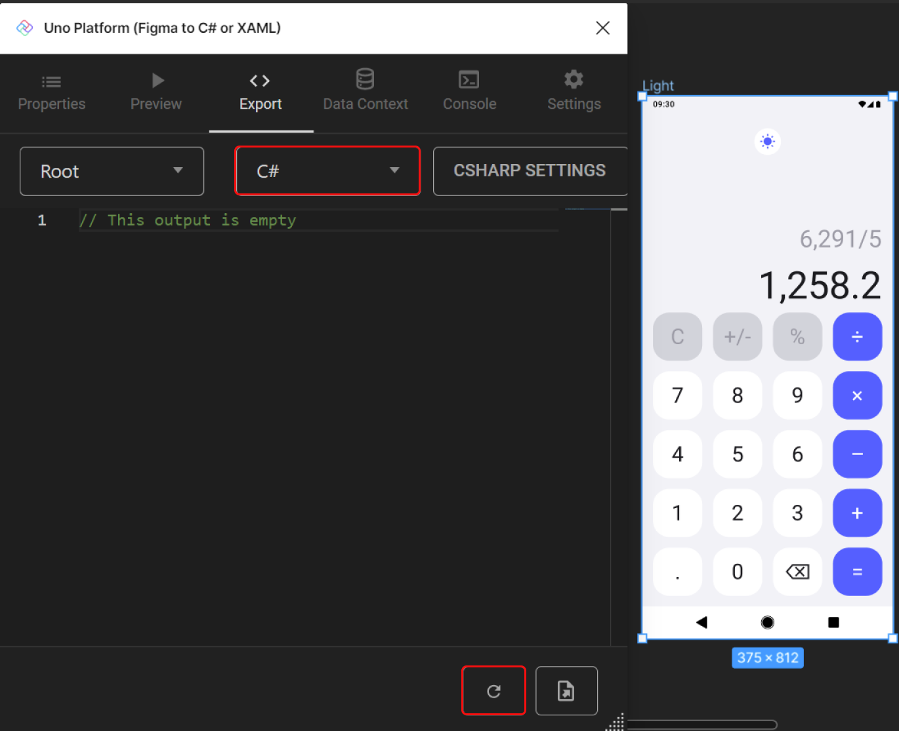
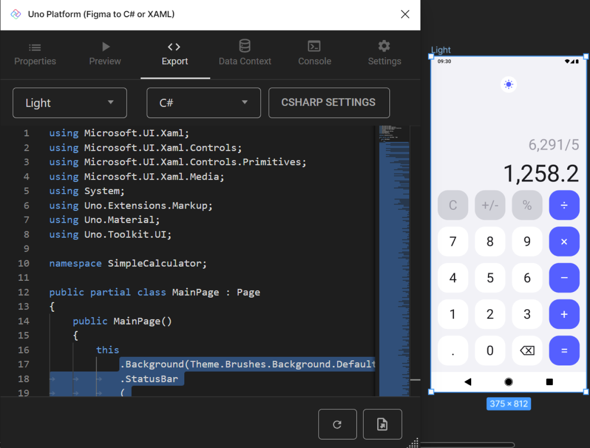

[!include[Setting up Figma Plugin](../../../Import-UI-from-Figma/Intro.md)]

2.	Run the plugin by right-clicking on the design and selecting "Plugins" > Uno Platform (Figma to C# or XAML).

7.	Once the plugin is running, select the "Export" tab, and choose "C#" as your export language, then click "Refresh" (the circular arrow button at the bottom).

    

8.	Select all the code starting from the line following `this` and ending at the semicolon (;).

    

9.	Copy the selected code to your clipboard (CTRL+C on Windows).

<details>
    <summary><i>MainPage.cs</i> code contents (collapsed for brevity)</summary>

[!code-csharp[MainPage.cs](MainPage.cs)]
</details>

4. Copy the selected code to the clipboard (<kbd>Ctrl</kbd>+<kbd>C</kbd> on Windows).

5. Open *MainPage.cs* and replace all the existing code following `this` and ending at the semicolon (`;`) with the copied code.

6.	To set the appropriate font size for all buttons, go to the Figma Plugin in the "Export" tab, select "Fonts Override File" from the dropdown menu, and copy the content in the ResourceDictionary.

7. Access the "MaterialFontsOverride.cs" file in the "Style" folder and replace it with your "MaterialFontsOverride.cs."


<details>
    <summary><i>MaterialFontsOverride.cs</i> code contents (collapsed for brevity)</summary>

[!code-csharp[MaterialFontsOverride.cs](MaterialFontsOverride.cs)]
</details>

8. Now we need to prepare our UI with the Binding expressions that we will need in the App Architecture module. First let's add the `DataContext` to the page. To do so add `.DataContext(new TempDataContext(), (page, vm) => page` before the `.Content` definition. Ensure to properly terminate the DataContext with a closing `)` preceding the semicolon at the end of the page's code.

```csharp
this
    .Background(Theme.Brushes.Background.Default)
    .StatusBar(foreground: StatusBarForegroundTheme.Light)
    .Resources
    (
        r => r
            ...
    )
    .DataContext(new TempDataContext(), (page, vm) => page
    .Content
    (
        ...
    )
    );
```

For all buttons we need to add `Command(() => vm.InputCommand)` and `CommandParameter` that will receive the same content as the `Content` attribute. For example, the first button would then be:

```csharp
new Button()
    .Background(Theme.Brushes.OnSurface.Inverse.Default)
    .Content("C")
    .Height(72)
    .CornerRadius(24)
    .Style(Theme.Button.Styles.FilledTonal)
    .AutoLayout
    (
        counterAlignment: AutoLayoutAlignment.Start,
        primaryAlignment: AutoLayoutPrimaryAlignment.Stretch
    )
    .CommandParameter("C")
    .Command(() => vm.InputCommand),
```

Apply these instructions to all the buttons on our page, except for the delete (back) button, which should display "⌫". Remember that for this specific button, set the `CommandParameter` as the text "back".

Last we need to update our `ToggleButton` with the Binding expression `IsChecked(x => x.Bind(() => vm.IsDark).TwoWay())"` for the theme switching (Light and Dark).

```csharp
new ToggleButton()
    .Background(Theme.Brushes.Surface.Default)
    .Margin(10,24)
    .CornerRadius(20)
    .AutoLayout(counterAlignment: AutoLayoutAlignment.Center)
    .IsChecked(x => x.Bind(() => vm.IsDark).TwoWay())
    .Content
    (
        ...
    )
    .ControlExtensions
    (
        ...
    ),
```

[!include[Conclude Figma Plugin](../../../Import-UI-from-Figma/Conclusion.md)]