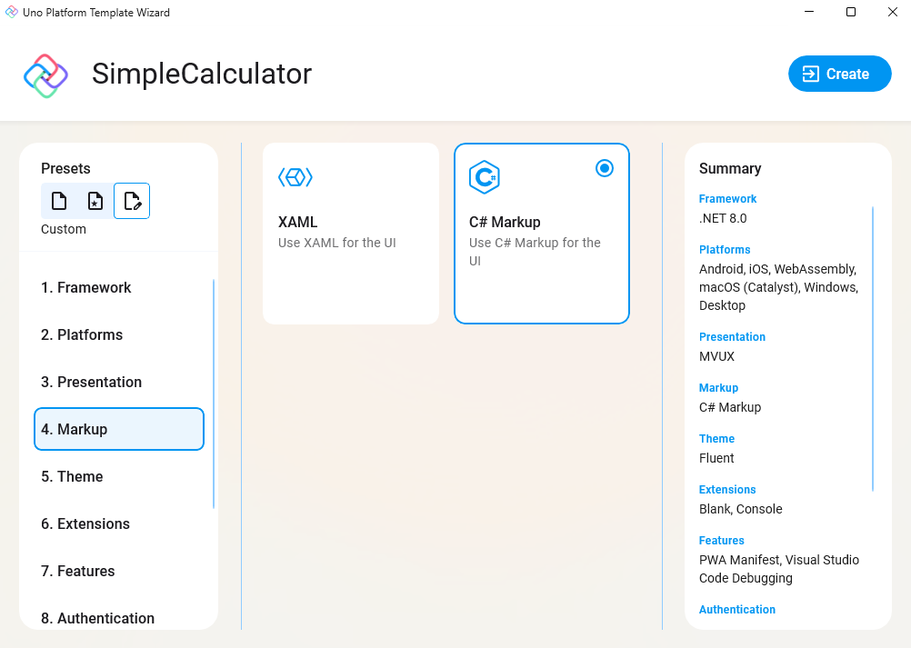

Now, let's move to the "4. Markup" menu option, and let's choose **C# Markup** for your UI.

<picture>
  <source media="(prefers-color-scheme: dark)" srcset="../../../art/Dark/Wizard/5.Markup-CSharp.png">
  <source media="(prefers-color-scheme: light)" srcset="../../../art/Light//Wizard/5.Markup-CSharp.png">
  
</picture>