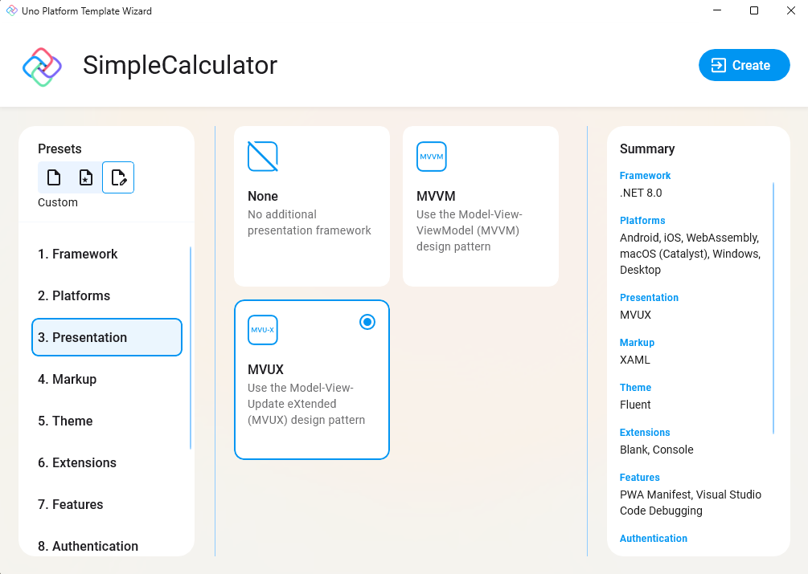

Then, select "3. Presentation" and choose the **MVUX** pattern.

<picture>
  <source media="(prefers-color-scheme: dark)" srcset="../../../art/Dark/Wizard/4.Presentation-MVUX.png">
  <source media="(prefers-color-scheme: light)" srcset="../../../art/Light/Wizard/4.Presentation-MVUX.png">
  
</picture>

> To know more about MVUX follow the [MVUX Overview](https://aka.platform.uno/mvux) docs.
