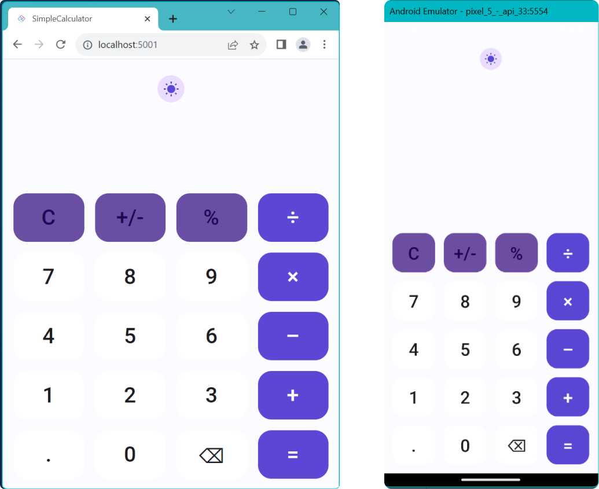

# Creating the Layout

Open the MainPage.xaml and add the following resources inside the `Page` element. These resources will be used by a `ToggleButton`, which we'll add shortly, that will switch between light and dark themes.

```xml
<Page.Resources>
  <x:String x:Key="MoonIcon">F1 M 3 0 C 1.9500000476837158 0 0.949999988079071 0.1600000262260437 0 0.46000003814697266 C 4.059999942779541 1.7300000190734863 7 5.519999980926514 7 10 C 7 14.480000019073486 4.059999942779541 18.27000093460083 0 19.540000915527344 C 0.949999988079071 19.840000927448273 1.9500000476837158 20 3 20 C 8.519999980926514 20 13 15.519999980926514 13 10 C 13 4.480000019073486 8.519999980926514 0 3 0 Z</x:String>
  <x:String x:Key="SunIcon">F1 M 5.760000228881836 4.289999961853027 L 3.9600000381469727 2.5 L 2.549999952316284 3.9100000858306885 L 4.340000152587891 5.699999809265137 L 5.760000228881836 4.289999961853027 Z M 3 9.949999809265137 L 0 9.949999809265137 L 0 11.949999809265137 L 3 11.949999809265137 L 3 9.949999809265137 Z M 12 0 L 10 0 L 10 2.950000047683716 L 12 2.950000047683716 L 12 0 L 12 0 Z M 19.450000762939453 3.9100000858306885 L 18.040000915527344 2.5 L 16.25 4.289999961853027 L 17.65999984741211 5.699999809265137 L 19.450000762939453 3.9100000858306885 Z M 16.239999771118164 17.610000610351562 L 18.030000686645508 19.40999984741211 L 19.440000534057617 18 L 17.639999389648438 16.21000099182129 L 16.239999771118164 17.610000610351562 Z M 19 9.949999809265137 L 19 11.949999809265137 L 22 11.949999809265137 L 22 9.949999809265137 L 19 9.949999809265137 Z M 11 4.949999809265137 C 7.690000057220459 4.949999809265137 5 7.639999866485596 5 10.949999809265137 C 5 14.259999752044678 7.690000057220459 16.950000762939453 11 16.950000762939453 C 14.309999942779541 16.950000762939453 17 14.259999752044678 17 10.949999809265137 C 17 7.639999866485596 14.309999942779541 4.949999809265137 11 4.949999809265137 Z M 10 21.900001525878906 L 12 21.900001525878906 L 12 18.950000762939453 L 10 18.950000762939453 L 10 21.900001525878906 Z M 2.549999952316284 17.990001678466797 L 3.9600000381469727 19.400001525878906 L 5.75 17.600000381469727 L 4.340000152587891 16.190000534057617 L 2.549999952316284 17.990001678466797 Z</x:String>

</Page.Resources>
```

Next we'll add `Button` styles that define the style to be used by the calculator buttons that we'll add shortly. Add these `Style` resources, after the `MoonIcon` and `SunIcon` resources added in the previous step, but before the closing `Page.Resources` tag.

```xml
<Style x:Key="KeypadButton"
        TargetType="Button"
        BasedOn="{StaticResource ElevatedButtonStyle}">
    <Setter Property="FontSize" Value="32" />
    <Setter Property="Height" Value="72" />
    <Setter Property="HorizontalAlignment" Value="Stretch" />
    <Setter Property="VerticalAlignment" Value="Stretch" />
    <Setter Property="ut:ControlExtensions.Elevation" Value="0" />
</Style>

<Style x:Key="KeypadPrimaryButton"
        TargetType="Button"
        BasedOn="{StaticResource FilledButtonStyle}">
    <Setter Property="FontSize" Value="32" />
    <Setter Property="Height" Value="72" />
    <Setter Property="HorizontalAlignment" Value="Stretch" />
    <Setter Property="VerticalAlignment" Value="Stretch" />
</Style>

<Style x:Key="KeypadSecondaryButton"
        TargetType="Button"
        BasedOn="{StaticResource FilledTonalButtonStyle}">
    <Setter Property="Background" Value="{ThemeResource OnSurfaceInverseBrush}" />
    <Setter Property="FontSize" Value="32" />
    <Setter Property="Height" Value="72" />
    <Setter Property="HorizontalAlignment" Value="Stretch" />
    <Setter Property="VerticalAlignment" Value="Stretch" />
</Style>
```

We've added a new property to the `KeypadButton` component, `ut:ControlExtensions.Elevation`. To use this property, you must declare the `ut` namespace. You can do this by adding the following namespace declaration to the Page element: `xmlns:ut="using:Uno.Themes"`. Below, you can see the expected result in MainPage.xaml:

```xml
<Page x:Class="SimpleCalculator.MainPage"
	  xmlns="http://schemas.microsoft.com/winfx/2006/xaml/presentation"
	  xmlns:x="http://schemas.microsoft.com/winfx/2006/xaml"
	  xmlns:local="using:SimpleCalculator"
	  xmlns:d="http://schemas.microsoft.com/expression/blend/2008"
	  xmlns:mc="http://schemas.openxmlformats.org/markup-compatibility/2006"
	  mc:Ignorable="d"
	  xmlns:utu="using:Uno.Toolkit.UI"
	  xmlns:ut="using:Uno.Themes"
	  xmlns:calc="using:SimpleCalculator"
	  Background="{ThemeResource BackgroundBrush}">
```

For the layout of the page, start by creating a `Border` with a `Grid` inside to hold the content. Insert the following XAML after the `Page.Resources` closing tag, and before the `Page` closing tag, replacing any previous content generated by the template.

```xml
<Border utu:SafeArea.Insets="VisibleBounds"
        Background="{ThemeResource SecondaryContainerBrush}">
    <Grid MaxWidth="700"
            VerticalAlignment="Stretch">
        <Grid.RowDefinitions>
            <RowDefinition Height="Auto" />
            <RowDefinition Height="*" />
            <RowDefinition Height="Auto" />
            <RowDefinition Height="Auto" />
        </Grid.RowDefinitions>

        <!--Header-->

        <!--Output-->

        <!--Keypad-->

    </Grid>
</Border>    
```

You will notice from the layout we created that we have 3 placeholder comments for the header, output, and keypad regions of the calculator interface. We will break these three sections up to make it easier to build our UI. We will start with the header by adding a `ToggleButton` using the icon paths (i.e. string resources) that we defined earlier. 

Replace the `<!--Header-->` comment with the following XAML:

```xml
<!--Header-->
<ToggleButton Background="{ThemeResource SurfaceBrush}"
              Margin="8,24,8,0"
              HorizontalAlignment="Center"
              Style="{StaticResource IconToggleButtonStyle}"
              IsChecked="{Binding IsDark, Mode=TwoWay}"
              CornerRadius="20"
              VerticalAlignment="Top">
    <ToggleButton.Content>
        <PathIcon Data="{StaticResource SunIcon}"
                    Foreground="{ThemeResource PrimaryBrush}" />
    </ToggleButton.Content>
    <ut:ControlExtensions.AlternateContent>
        <PathIcon Data="{StaticResource MoonIcon}"
                    Foreground="{ThemeResource PrimaryBrush}" />
    </ut:ControlExtensions.AlternateContent>
</ToggleButton>
```

Next, we'll create the output row. This will be a `StackPanel` with two `TextBlock` elements for the calculator output. The `Text` property for each `TextBlock` is data bound to the `Equation` and `Output` properties on the `DataContext` respectively. 

Replace the `<!--Output-->` comment with the following XAML:

```xml
<!--Output-->
<StackPanel Grid.Row="2"
            Spacing="16"
            Padding="16,8"
            HorizontalAlignment="Stretch">
    <TextBlock Text="{Binding Calculator.Equation}"
               HorizontalAlignment="Right"
               Foreground="{ThemeResource OnSecondaryContainerBrush}"
               Style="{StaticResource DisplaySmall}" />
    <TextBlock Text="{Binding Calculator.Output}"
               HorizontalAlignment="Right"
               Foreground="{ThemeResource OnBackgroundBrush}"
               Style="{StaticResource DisplayLarge}" />
</StackPanel>
```

Finally, we'll need to create the keypad. This will be a `Grid` with 5 rows and 4 columns. We will add a `Button` to each cell of the `Grid`. We will also add a `Button` to the last cell of the first row to act as a clear button. 

Replace the `<!--Keypad-->` comment with the following XAML:

```xml
<!--Keypad-->
<Grid 
    Grid.Row="3" 
    RowSpacing="16"
    ColumnSpacing="16"
    Padding="16"
    MaxHeight="500">
    <Grid.RowDefinitions>
        <RowDefinition Height="*" />
        <RowDefinition Height="*" />
        <RowDefinition Height="*" />
        <RowDefinition Height="*" />
        <RowDefinition Height="*" />
    </Grid.RowDefinitions>
    <Grid.ColumnDefinitions>
        <ColumnDefinition Width="*" />
        <ColumnDefinition Width="*" />
        <ColumnDefinition Width="*" />
        <ColumnDefinition Width="*" />
    </Grid.ColumnDefinitions>

    <!--Row 0-->
    <Button 
        Grid.Row="0" 
        Grid.Column="0" 
        Command="{Binding InputCommand}" 
        CommandParameter="C" 
        Content="C" 
        Style="{StaticResource KeypadSecondaryButton}" />
    <Button 
        Grid.Row="0" 
        Grid.Column="1"
        Command="{Binding InputCommand}" 
        CommandParameter="±" 
        Content="±" 
        Style="{StaticResource KeypadSecondaryButton}" />
    <Button 
        Grid.Row="0" 
        Grid.Column="2" 
        Command="{Binding InputCommand}" 
        CommandParameter="%"
        Content="%" 
        Style="{StaticResource KeypadSecondaryButton}" />
    <Button 
        Grid.Row="0" 
        Grid.Column="3" 
        Command="{Binding InputCommand}" 
        CommandParameter="÷" 
        Content="÷" 
        Style="{StaticResource KeypadPrimaryButton}" />

    <!--Row 1-->
    <Button 
        Grid.Row="1" 
        Grid.Column="0" 
        Command="{Binding InputCommand}"
        CommandParameter="7" 
        Content="7" 
        Style="{StaticResource KeypadButton}" />
    <Button 
        Grid.Row="1"
        Grid.Column="1" 
        Command="{Binding InputCommand}" 
        CommandParameter="8" 
        Content="8" 
        Style="{StaticResource KeypadButton}" />
    <Button 
        Grid.Row="1" 
        Grid.Column="2" 
        Command="{Binding InputCommand}" 
        CommandParameter="9" 
        Content="9" 
        Style="{StaticResource KeypadButton}" />
    <Button 
        Grid.Row="1" 
        Grid.Column="3" 
        Command="{Binding InputCommand}" 
        CommandParameter="×" 
        Content="×" 
        Style="{StaticResource KeypadPrimaryButton}"  />

    <!--Row 2-->
    <Button 
        Grid.Row="2" 
        Grid.Column="0" 
        Command="{Binding InputCommand}" 
        CommandParameter="4" 
        Content="4" 
        Style="{StaticResource KeypadButton}" />
    <Button 
        Grid.Row="2" 
        Grid.Column="1" 
        Command="{Binding InputCommand}" 
        CommandParameter="5" 
        Content="5" 
        Style="{StaticResource KeypadButton}" />
    <Button 
        Grid.Row="2" 
        Grid.Column="2" 
        Command="{Binding InputCommand}" 
        CommandParameter="6" 
        Content="6" 
        Style="{StaticResource KeypadButton}" />
    <Button 
        Grid.Row="2" 
        Grid.Column="3" 
        Command="{Binding InputCommand}"
        CommandParameter="−" 
        Content="−" 
        Style="{StaticResource KeypadPrimaryButton}" />

    <!--Row 3-->
    <Button 
        Grid.Row="3" 
        Grid.Column="0"
        Command="{Binding InputCommand}"
        CommandParameter="1" 
        Content="1"
        Style="{StaticResource KeypadButton}" />
    <Button 
        Grid.Row="3" 
        Grid.Column="1" 
        Command="{Binding InputCommand}" 
        CommandParameter="2" 
        Content="2" 
        Style="{StaticResource KeypadButton}" />
    <Button 
        Grid.Row="3" 
        Grid.Column="2" 
        Command="{Binding InputCommand}" 
        CommandParameter="3" 
        Content="3"
        Style="{StaticResource KeypadButton}" />
    <Button 
        Grid.Row="3"
        Grid.Column="3" 
        Command="{Binding InputCommand}"
        CommandParameter="+" 
        Content="+" 
        Style="{StaticResource KeypadPrimaryButton}" />

    <!--Row 4-->
    <Button 
        Grid.Row="4"
        Grid.Column="0"
        Command="{Binding InputCommand}"
        CommandParameter="."
        Content="."
        Style="{StaticResource KeypadButton}" />
    <Button 
        Grid.Row="4" 
        Grid.Column="1" 
        Command="{Binding InputCommand}" 
        CommandParameter="0" 
        Content="0" 
        Style="{StaticResource KeypadButton}" />
    <Button 
        Grid.Row="4" 
        Grid.Column="2" 
        Command="{Binding InputCommand}" 
        CommandParameter="back" 
        Style="{StaticResource KeypadButton}" >
        <Button.Content>
            <FontIcon Glyph="&#xE926;"
                      FontSize="36" />
        </Button.Content>
    </Button>
    <Button 
        Grid.Row="4" 
        Grid.Column="3"
        Command="{Binding InputCommand}"
        CommandParameter="=" 
        Content="=" 
        Style="{StaticResource KeypadPrimaryButton}" />
</Grid>
```

Now run the app. You should see the calculator UI that looks similar to the following:

<picture>
  <source media="(prefers-color-scheme: dark)" srcset="../../../art/Dark/app-looks.png">
  <source media="(prefers-color-scheme: light)" srcset="../../../art/Light/app-looks.png">
  
</picture>

Great, now our UI is updated and is ready for data binding. We will pick up with data binding in the next section.

## Next Steps

In this module we created the Calculator UI. In the next module we will add data binding to the Calculator.
