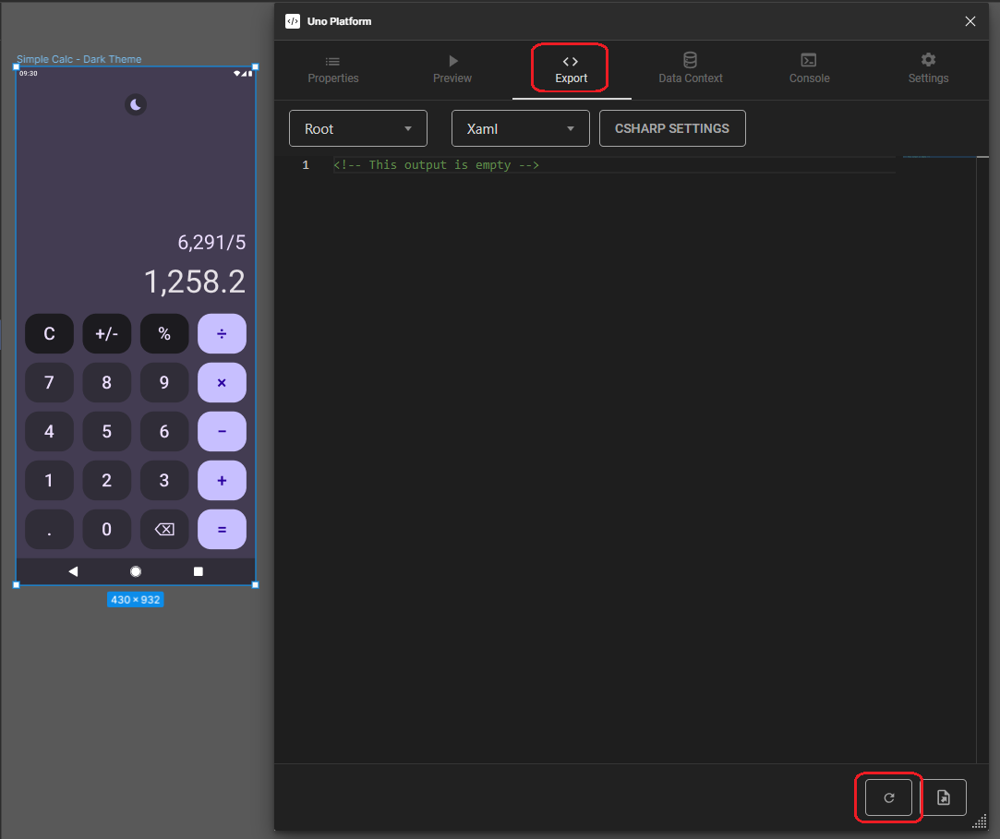
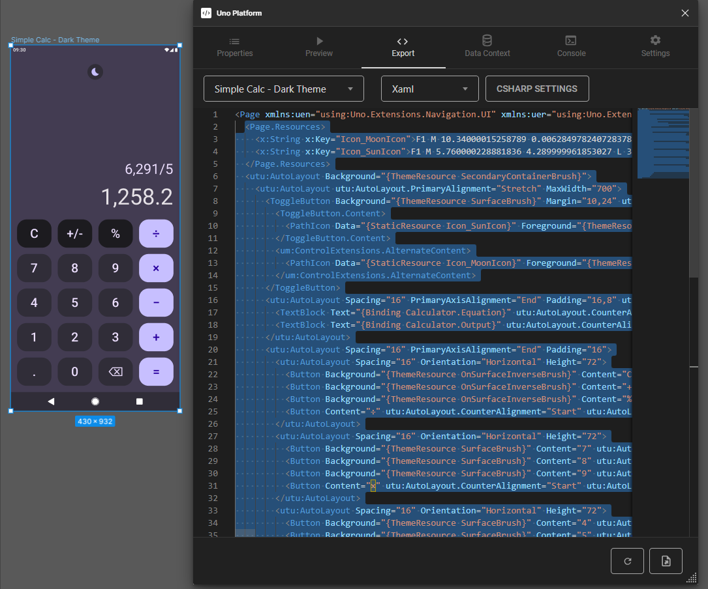
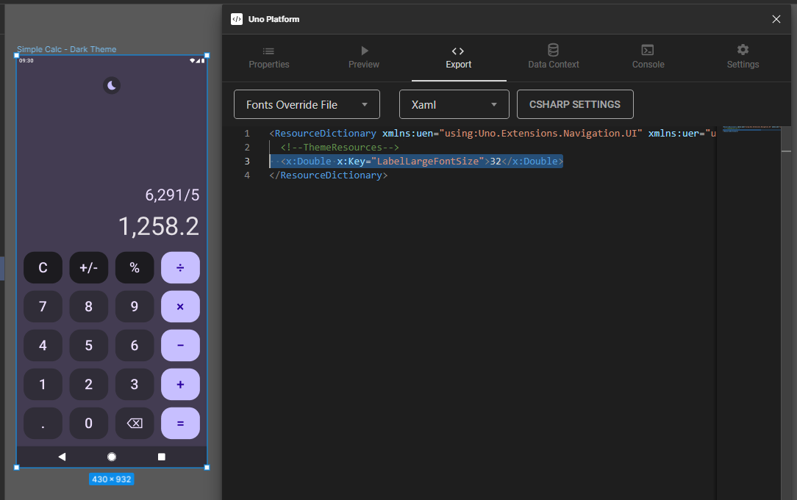

[!include[Setting up Figma Plugin](../../../Import-UI-from-Figma/Intro.md)]

2. Open the Export tab, note that Xaml is selected as the markup language to be exported, then click Refresh (the circled arrow button on the bottom).



3. Select all contents starting from the line `<Page.Resources>` until the last `</utu:AutoLayout>`.



<details>
    <summary><i>MainPage.xaml</i> code contents (collapsed for brevity)</summary>

[!code-xml[MainPage.xaml](MainPage.xaml)]
</details>

4. Copy the selected code to the clipboard (<kbd>Ctrl</kbd>+<kbd>C</kbd> on Windows).

5. Open MainPage.xaml and replace all the Page contents with the copied code.

6. To set the appropriate font size for all buttons, access the MaterialFontsOverride.xaml file in the Style folder. Go to the Figma Plugin, in the Export tab, and select Fonts Override File from the dropdown menu. Copy the content in the ResourceDictionary and replace it in your MaterialFontsOverride.xaml file.



<details>
    <summary><i>MaterialFontsOverride.xaml</i> code contents (collapsed for brevity)</summary>

[!code-xml[MaterialFontsOverride.xaml](MaterialFontsOverride.xaml)]
</details>

7. Now we need to prepare our UI with the Binding expressions that we will need in the App Architecture module. For all buttons we need to add `Command="{Binding InputCommand}"` and `CommandParameter` that will receive the same content as the `Content` attribute. For example, the first button would then be:

```xml
<Button Background="{ThemeResource OnSurfaceInverseBrush}" 
        Content="C" 
        utu:AutoLayout.CounterAlignment="Start" 
        utu:AutoLayout.PrimaryAlignment="Stretch" 
        Height="72" 
        CornerRadius="24" 
        Style="{StaticResource FilledTonalButtonStyle}"
        CommandParameter="C"
        Command="{Binding InputCommand}" />
```

Last we need to update our `ToggleButton` with the Binding expression `IsChecked="{Binding IsDark, Mode=TwoWay}"` for the theme switching (Light and Dark).

```xml
<ToggleButton Background="{ThemeResource SurfaceBrush}" 
              Margin="10,24"
              utu:AutoLayout.CounterAlignment="Center" 
              CornerRadius="20"
              IsChecked="{Binding IsDark, Mode=TwoWay}">
...
</ToggleButton>
```

[!include[Conclude Figma Plugin](../../../Import-UI-from-Figma/Conclusion.md)]