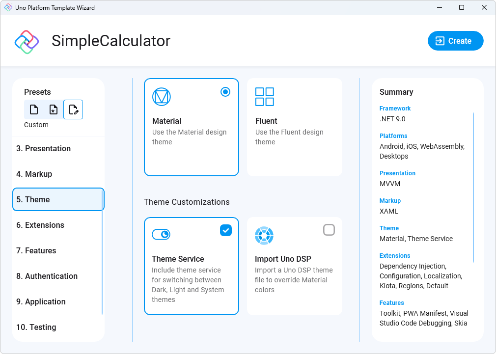
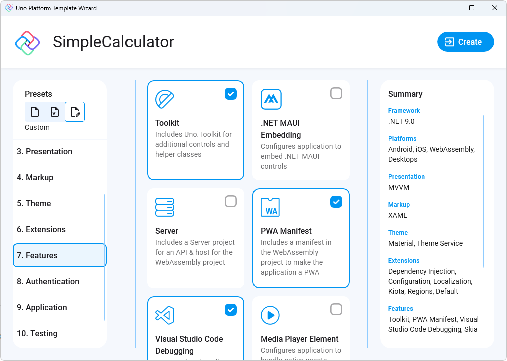

Next, let's select the Material library for our app theme. Click on "5. Theme" from the left menu and select "Material", then under the Theme Customizations section select "Theme Service" to have access to theme switching between Dark and Light feature.

> To know more about Themes in Uno follow the [Themes Overview](https://aka.platform.uno/uno-themes) docs.

Next, let's move to the "7. Features" menu option, and select the "Toolkit" option for the helper functions to switch themes

> To know more about Uno Toolkit follow the [Getting Started with Uno Toolkit](https://aka.platform.uno/uno-toolkit) docs.

 Finally, click on the "Create" button to finish.
