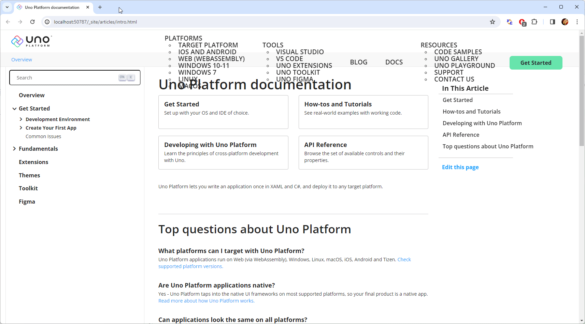

The content of the workshops is embedded as part of the Uno Platform docs using DocFx.

To test the workshop follow these instructions:

1. Clone the main Uno Platform repo. If this is already cloned, make sure the branch you're running is up-to-date with the upstream master branch.
1. Open the *doc\import_extenal_docs_test.ps1* script in an editor, and modify the *workshops* element to point to the branch you want to test (if it's commented out, you may need to uncomment it first):

    ```bash
    "workshops" = "master"
    ```

1. Open a PowerShell CLI, navigate to the *uno* repo's *doc* folder and call the *import_external_docs_test* script:
 
    ```bash
    PS> cd unoplatform/uno/doc
    PS> .\import_external_docs_test
    ```

1. DocFx will run through the docs and will print out warnings and error messages found in the contents. This is a good chance to hunt for any errors in the docs (sometimes there are issues with referenced toc files, so you may need to comment those out to get docfx to build)
1. The browser will launch the docs site, note the port number.
1. Switch between browsing mode and viewing mode by including/excluding the `_site` route and alternating between the *md*/*html* extension respectively:

    

    Some mis-designed objects can be ignored, these are applied from the production CSSs.
 1. When done, come back to the CLI and press <kbd>Ctrl</kbd>+<kbd>C</kbd> to terminate the docs server.
