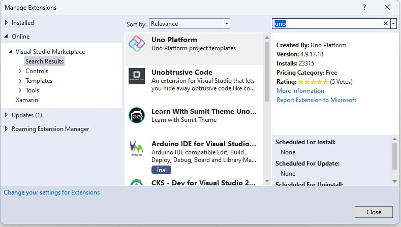
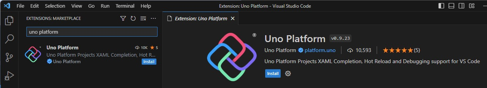
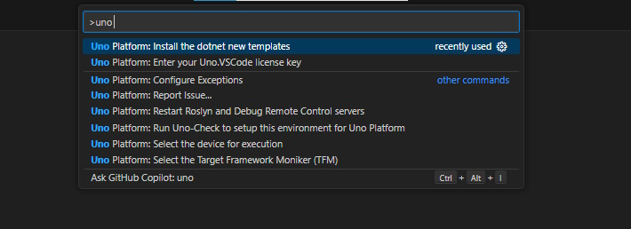
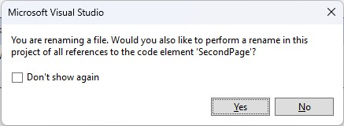
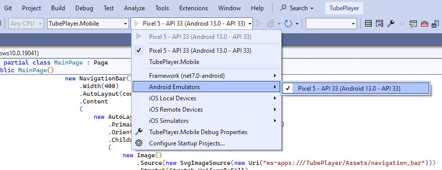
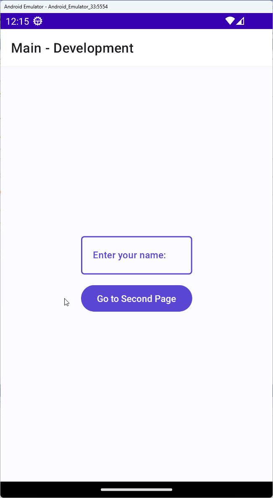

# Module 1 - Getting Started

The Uno Platform is a multi-platform solution for building native apps for iOS, Android, Windows, macOS, Web, and Linux.

This module will walk you through the process of getting started with Uno Platform and creating a project, using either the template wizard or the dotnet new template, that will be used for the rest of this workshop.

## Setting up the Environment

Building native applications requires a few tools to be installed on your machine. The following sections will walk you through the process of installing these tools and verifying that your environment is ready to go.

### Uno Check

Before getting started with development, we recommend that you run the Uno Check tool to ensure that your environment is set up correctly for Uno Platform app development. This tool will check for the required workloads and SDKs, and will also check for any known issues with your environment.

1. Execute the following command in the command line terminal (the current folder of the terminal doesn't matter):

    ```
    dotnet tool install --global Uno.Check
    ```

    If the tool is already installed, replace `install` with `update`.


1. Once installed, run the tool by executing the following command:

    ```
    uno-check
    ```

> [!NOTE]  
> You may need to take additional steps if trying to build the Linux or GTK heads on Windows.
> Be sure to follow the [Additional setup for Linux or WSL](xref:Uno.GetStarted.Linux) docs.  


### Uno Platform Extensions and Templates

# [Visual Studio](#tab/vs)

For the best developer experience inside Visual Studio when creating an Uno Platform application, install the [Uno Platform extension for Visual Studio 2022](https://marketplace.visualstudio.com/items?itemName=unoplatform.uno-platform-addin-2022) by following [these instructions](xref:Uno.GetStarted.vs2022#install-the-solution-templates).

This extension includes the Uno Platform solution and item templates.



# [Visual Studio Code](#tab/vscode)

If you're using Visual Studio Code, make sure to install the latest version of the Uno Platform extension [Visual Studio Code Marketplace](https://marketplace.visualstudio.com/items?itemName=unoplatform.vscode)



We will also install Uno Platform project templates using the command line interface. To ensure the templates are installed, run the following command:

```bash
dotnet new install Uno.Templates
```


> [!NOTE]  
> Make sure the latest version of the Uno.Templates version is installed.
> If you have already installed this in the past, you can update the current templates by running the following:
>
> ```bash
> dotnet new update
> ```

Alternatively, from within Visual Studio Code, you can also install the templates by selecting the `Install  the dotnet new templates` option in the Command Palette.




Now that the templates are installed we can list the options for the `unoapp` template with the following command:

```bash
dotnet new unoapp -?
```

This template will be used in the next section to create the starting point for the application to be used in the rest of this workshop.

---

### Obtaining a YouTube Data API v3 Key [optional]

The purpose of the application to be built in this workshop is to search for, and play, YouTube videos. To query this data from YouTube, a YouTube API v3 needs to be obtained. This is optional, and the workshop can be completed without a key, but you will not be able to search for or play videos.

In the following steps, we will walk you through [this tutorial](https://developers.google.com/youtube/v3/getting-started), and provide you with detailed screenshots on how to obtain a YouTube Data API v3 key.

<!-- [!INCLUDE [Google API key instructions](google-api-key.md)] -->
[Google API Key Instructions](xref:Workshop.TubePlayer.GetStarted.ApiKey){:target="_blank"}

## Creating the project

To create a new Uno Platform app, there are two options available to developers. The first is to use the Visual Studio extension which provides a guided approach to creating an Uno Platform app.
The other one is to use the dotnet new `unoapp` template, which enables customizing the generated projects with parameters and modifiers.

In the following sections, we will cover both methods for creating a new Uno app, providing step-by-step instructions for each.

# [Visual Studio](#tab/vs)

[!INCLUDE [Template wizard](templates-wizard.md)]

# [Visual Studio Code or other](#tab/vscode)

[!INCLUDE [Template CLI](templates-cli.md)]

---

If you open the newly created application in Visual Studio, you might be asked to reload projects before the solution is fully loaded. Click `Reload projects` if you see this message.

  

## Preparing the Solution

Before we jump into building out the functionality of the TubePlayer application, we'll do a few house-keeping steps to prepare the solution for the rest of the workshop.

## Rename files

1. Rename the file *Presentation* → *SecondModel.cs* to *VideoDetailsModel.cs*, and *SecondPage.cs* to *VideoDetailsPage.cs*.  
    If you're using Visual Studio and you're asked to also rename all references of `SecondPage` and `SecondModel` click *Yes*.

    

1. In *VideoDetailsModel.cs*, ensure the record name has changed to `VideoDetailsModel`, otherwise change it manually.

1. In *VideoDetailsPage.cs*, ensure `SecondPage` has changed to `VideoDetailsPage` in both the class name and constructor, otherwise change it manually, then change `BindableSecondModel` to `BindableVideoDetailsModel`.

1. Make sure these references have also been changed in *App.cs*.

1. In *App.cs*, also rename the route map path from `Second` to `VideoDetails`:

    ```c#
    new RouteMap("VideoDetails", View: views.FindByViewModel<VideoDetailsModel>()),
    ```

The TubePlayer app will consist of two pages, a search page, and a video-player page. *MainPage.cs* and *MainModel.cs* will be used as the search page. *VideoDetailsPage.cs* and *VideoDetailsModel.cs* will be used to display additional video details and play the video using a media player element.

## Running the application

1. Ensure a startup project is selected. Either right-click the desired project head in Solution Explorer (e.g. *TubePlayer.Mobile*) and select *Set as startup project*, or select this project from the Startup projects dropdown.
    When selecting *Mobile*, you could then select which mobile platform to run and on which emulator.  
    The emulator can be selected from the subsequent menu as shown in the picture:

    

1. Press <kbd>F5</kbd> to run the project.  
  This is what you expect the app to look like:

    

> [!NOTE]  
> If you see an error message mentioning the old type names (*SecondPage*/*SecondModel*), try cleaning the solution. In Visual Studio, you'd right-click the solution and then *Clean*. Otherwise, call `dotnet clean` from the `TubePlayer`'s solution folder.

To learn more about debugging the app on different platforms read this:

# [Visual Studio](#tab/vs)

[Debug in Visual Studio](xref:Uno.GetStarted.vs2022#create-an-application)

# [Visual Studio Code](#tab/vscode)

[Debug in Visual Studio Code](xref:Uno.GetStarted.vscode#run-and-debug-application)

---

## Additional Resources

- [Uno Documentation - Getting Started](xref:Uno.GetStarted)
- [Uno Documentation - Uno Check](xref:UnoCheck.UsingUnoCheck)
this tutorial,

**[Next](xref:Workshop.TubePlayer.BasicLayout "Creating basic UI layout with C# Markup")**
