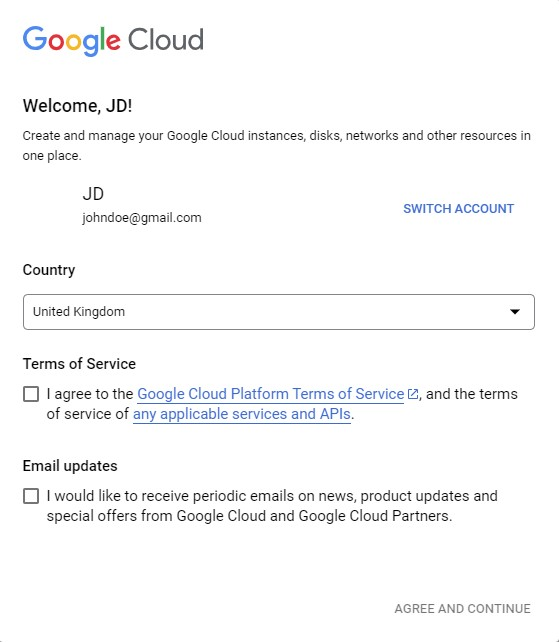
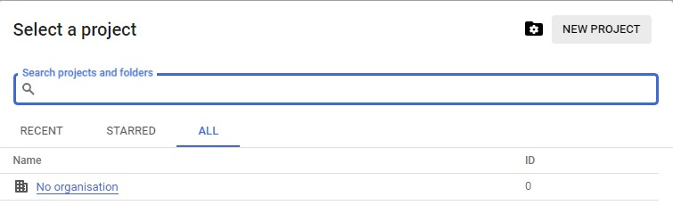
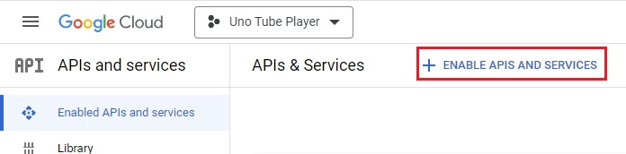
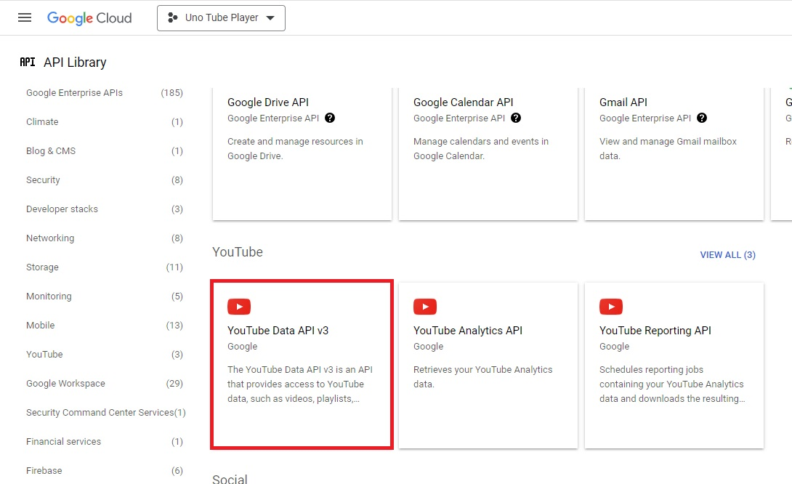
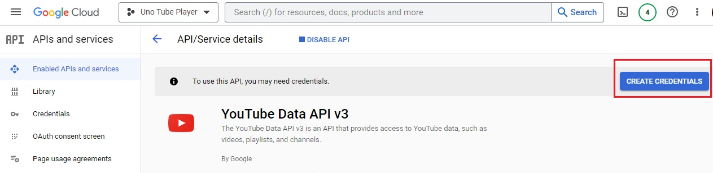
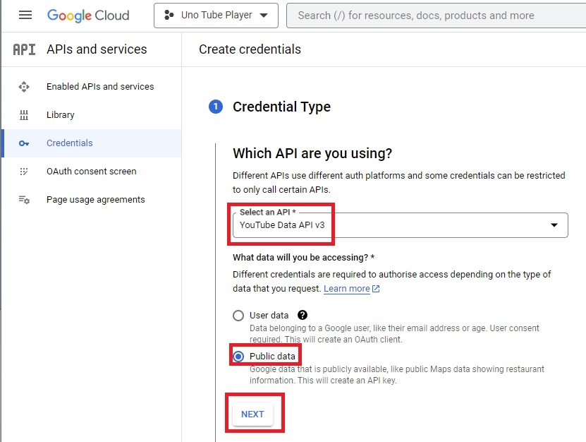
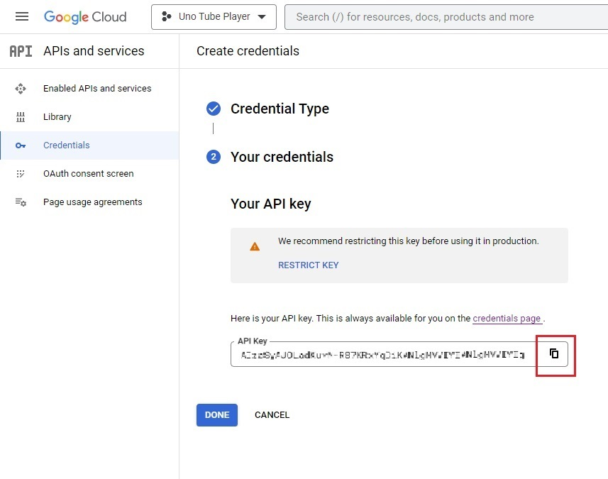
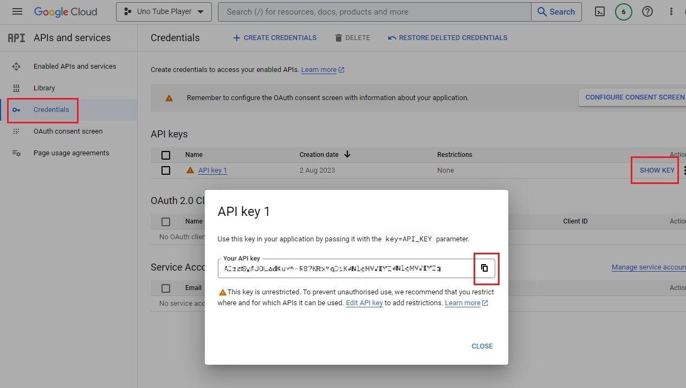

    
Detailed instructions on obtaining a YouTube API key

### Create a new project in Google Console

1. Open the [Enabled APIs and services](https://console.cloud.google.com/apis/dashboard) page in the Google Console Dashboard.

    If this is the first time you're using Google Console, you might see a message similar to this one:

    

    Agree to the terms of service.

1. On the top of the page, click the projects dropdown:

    

1. Then, on the popup that opens, click *New project*:

    

1. Give the project a descriptive title, such as *Uno Tube Player*, and click *Create*.  
    The project will now be created and selected in the top dropdown.

    

    If you can't see the project, try refreshing the page.

### Enable YouTube APIs for this project

1. If you are not already, navigate back to the *Enabled APIs and services page*, and click *Enable APIs and services*

    

1. From the APIs page, click *YouTube Data API v3* (you can search for it):

    

1. Click *Enable*

    

### Obtain an API key

1. Once YouTube Data API v3 has been enabled, [its page](https://console.cloud.google.com/apis/api/youtube.googleapis.com) will open.

    

1. Click *Create credentials* and select *Public data*, then click *Next*.

    

1. The API key will be revealed to you, click the copy button and copy the API key somewhere safe and private, it will be used in [Module 8 - API endpoints](xref:Workshop.TubePlayer.ApiEndpoints) when searching YouTube's data.

    

    Alternatively, keep this tab open to copy the API key later.

1. You can always access the API key via the credentials menu on the left side.

    

