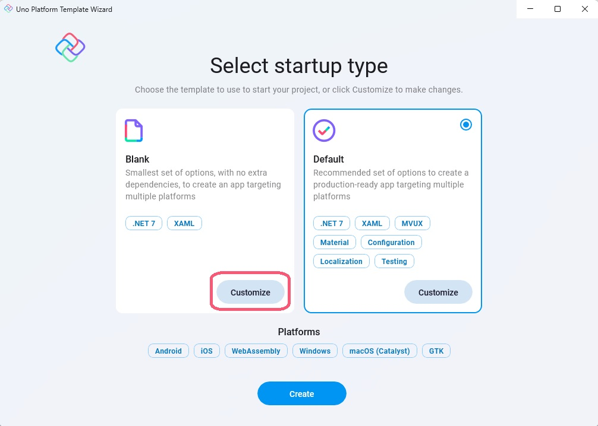

The Uno Platform solution template wizard guides you through generating a new project and enables you to customize it and select the options suitable for your project.  
In this project we'll create a customized blank template that includes the following features and extensions:

- C# markup
- MVUX framework
- Material theme
- DSP import for theme color overrides
- Dependency Injection, Configuration and Navigation extensions
- Uno Toolkit

The HTTP and Refit extension will be added manually at [a later stage](xref:Workshop.TubePlayer.ApiEndpoints).

To generate your project, hit <kbd>Ctrl</kbd>+<kbd>Shift</kbd>+<kbd>N</kbd> (File → New → Project) and select 'Uno Platform App' from the options window. You can search for 'Uno' if it's not instantly visible.

The next page is the regular Visual Studio project location choice. Choose a suitable location, name the project 'TubePlayer', and click *Create*.

After clicking *Next*, the first page of the Uno Platform template wizard will open, enabling you to choose from one of the following two options: *Blank* and *Default*. Click the button *Customize* of the *Blank* option, to move to the next page where additional options can be selected before generating the *Blank* template.

The upcoming page will enable you to select additional features.

- In ***Presentation*** tab select *MVUX*.
- In ***Markup*** tab select *C# Markup*.
- In ***Theme*** tab select *Material* and check *Import DSP*.
- In ***Extensions*** tab check: *Dependency Injection*, *Configuration*, then under *Navigation*, select *Regions*.
- In ***Features*** tab select *Toolkit*.

Click *Create* for the project to be generated.