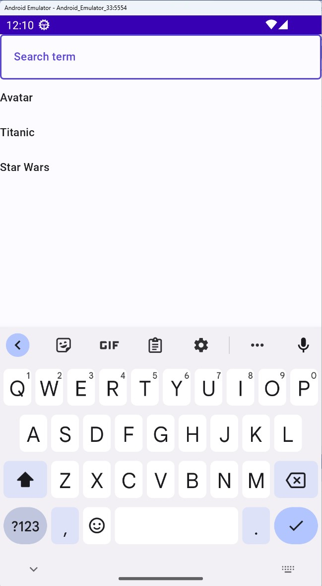

# Module 2 - Creating basic UI layout with C# markup

In this module, you will use C# markup to create a UI. This will comprise of a `Grid` containing a `TextBox` which will be used to search for YouTube videos, as well as a [`ListView`](https://learn.microsoft.com/windows/apps/design/controls/listview-and-gridview) which will display results. In this module you'll rather focus on creating the UI, you will create data services and populate these controls with data in the next module.  

You will also learn in this module how to set up basic data-binding to a feed/state in the model.

[!NOTE]
>With the new single project architecture, the majority of the application development—spanning UI, presentation layer, and service layer functionalities—occurs within the unified project. This consolidates the shared functionality across all target platforms into one central location, streamlining the development process. 
>For platform-specific implementations, use the Platforms folder within the same project. This directory allows for organizing platform-specific code and resources, ensuring that any necessary platform-specific tasks are neatly integrated without cluttering the shared application logic.

## Create a UI

1. Open the file *MainPage.cs*, and replace its constructor content with the following:

    ```csharp
    this.NavigationCacheMode(NavigationCacheMode.Required)
        .Background(Theme.Brushes.Background.Default)
        .Content(
            new Grid()
            .SafeArea(SafeArea.InsetMask.All)
            .RowDefinitions("Auto, *")
            .Children(
                new TextBox()
                    .PlaceholderText("Search term"),
                new ListView()
                    .Grid(row: 1)
                    .ItemsSource(new[] { "Avatar", "Titanic", "Star Wars" })
                    .ItemTemplate<string>(videoTitle =>
                        new TextBlock()
                            .Text(() => videoTitle))));
    ```

    The `ItemTemplate` extension method takes a generic argument of the expected item type. In this example, we'll be using a `string`. In the upcoming modules, you'll incorporate service data in the app, and this data type (`string`) will change.

## Clean up the model

1. For now, let's clean up the model, open the *MainModel.cs* file, and replace its contents with the following:

    ```csharp
    namespace TubePlayer.Presentation;
    
    public partial record MainModel();
    ```

## Run the app

Launch the app to see the UI rendered. Observe that there are currently no underlying data, just empty controls. In the following module, we will create data services from which the controls will be populated with data.
    The rendered app will look similar to the following:



**[Previous](xref:Workshop.TubePlayer.GetStarted "Getting started")** | **[Next](xref:Workshop.TubePlayer.MockData "Connect UI with mock data")**
