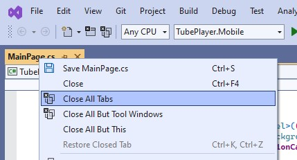
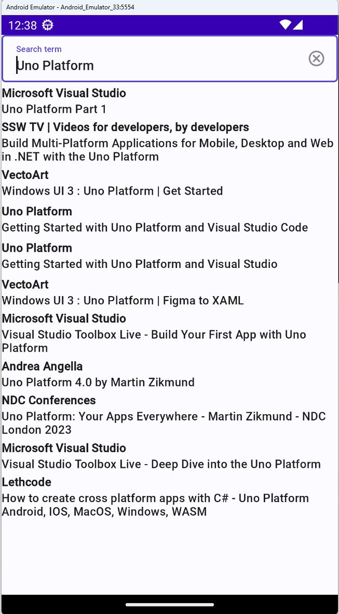
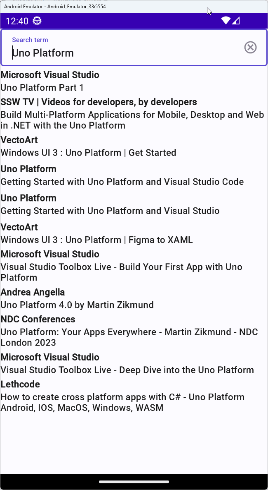

# Module 3 - Connect UI with mock data

In this module, you will create models and services that will be used by the presentation layer to retrieve data and display it in the appropriate UI controls. You are first going to add a mock service that will simulate YouTube search results. In module 9, you will wire the service up with live search results from YouTube's API.

## Create entities

[!INCLUDE [Create entities](create-entities.md)]

## Add mock data service

In the *Business* folder, add a class named *YoutubeServiceMockData.cs*, and replace its content with the following:

<details>
    <summary><i>YoutubeServiceMockData.cs</i> code contents (collapsed for brevity)</summary>

[!code-csharp[YoutubeServiceMockData.cs](YoutubeServiceMockData.cs)]
</details>

This class contains two constant variables that are assigned to partial JSON output results taken from a real YouTube search query of the term 'Uno Platform'.

## Create service interface, mock data, mock service, and register services

1. In the same folder (*Business*), create a new interface file named *IYoutubeService.cs*, that will represent our data service.
    Ignore errors you might see while editing the following files, these will addressed soon by adding the missing namespaces globally.

    ```csharp
    namespace TubePlayer.Business;

    public interface IYoutubeService
    {
        Task<YoutubeVideoSet> SearchVideos(string searchQuery, string nextPageToken, uint maxResult, CancellationToken ct);
    }
    ```

1. Add another class named *YoutubeServiceMock.cs* to the *Business* folder and replace its content with the following:

    <details>
        <summary><i>YoutubeServiceMock.cs</i> code contents (collapsed for brevity)</summary>

    [!code-csharp[YoutubeServiceMock.cs](YoutubeServiceMock.cs)]
    </details>

The `SearchVideos` method reads the JSON result you added in the previous instruction and deserializes it into `ChannelSearchResultData` and `VideoDetailsResultData` objects respectively.

## Register service

As we've selected Dependency Injection when generating the app, it includes full DI support on all platforms.  
You will now register the `YoutubeServiceMock` to be provided every time an `IYoutubeService` is requested.

1. Open *GlobalUsings.cs* and append the following lines to it:

    ```csharp
    global using System.Text.Json;
    global using TubePlayer.Business;
    global using TubePlayer.Services.Models;
    ```    

    In Visual Studio, you can sort the usings, go to the menu and click *Edit* → *IntelliSense* → *Sort Usings* (<kbd>Alt</kbd>+<kbd>E</kbd>,<kbd>I</kbd>,<kbd>S</kbd>).

1. Open the *App.cs* file (in the project folder), head to the `ConfigureServices` section, remove the comments in it, and add the following registrations instead:

    ```csharp
    services.AddSingleton<IYoutubeService, YoutubeServiceMock>();
    ```

1. Before the line `.ConfigureServices` add the following service registration:

    ```csharp
    .UseSerialization(services =>
    {
        services.AddSingleton(new JsonSerializerOptions { PropertyNamingPolicy = JsonNamingPolicy.CamelCase });
    })
    ```

    This sets up Uno Platform's [serialization extension](xref:Overview.Serialization).

## Setup the presentation layer with the service

### Use mock service in the model

1. Open the file *MainModel.cs* and replace its content with the following:

    ```csharp
    namespace TubePlayer.Presentation;
    
    public partial record MainModel(IYoutubeService YoutubeService)
    {
        public IState<string> SearchTerm => State<string>.Value(this, () => "Uno Platform");
    }
    ```

    The `SearchTerm` is an MVUX state, with "Uno Platform" set as its default value. Feeds and states are part of the [MVUX framework](https://aka.platform.uno/mvux) developed by Uno Platform.  
    Both feeds and states are used as an async data connection point between the model and its underlying services. The MVUX also offers controls that can interact with feeds and states.  
    The difference between states and feeds is that a state holds the state of the data and can be updated manually, whereas feeds only act as a bridge to the data coming from the service.

    To learn more about MVUX, refer to the [MVUX docs](xref:Overview.Mvux.Overview).

1. After the `SearchTerm` property, add another property. Contrary to the `SearchTerm` which is a [state](xref:Overview.Mvux.States) to support two-way binding to and from the search `TextBox`, the `VideoSearchResults` property we are now adding will be a [list-feed](xref:Overview.Mvux.ListFeeds) (a feed of a collection of items) that requests and obtains the search results we just set up in the mock service.  

    ```csharp
    public IListFeed<YoutubeVideo> VideoSearchResults => SearchTerm
        .Where(searchTerm => searchTerm is { Length: > 0 })
        .SelectAsync(async (searchTerm, ct) =>
            await YoutubeService.SearchVideos(searchTerm, nextPageToken: string.Empty, maxResult: 30, ct))
        .Select(result => result.Videos)
        .AsListFeed();
    ```

### Bind UI

1. Go back to *MainPage.cs* and set the `Page`'s `DataContext` to the generated bindable proxy of `MainModel`, by adding the following line to the beginning of the UI tree (after `this.`).

    ```diff
    +this.DataContext<BindableMainModel>((page, vm) => page
         .NavigationCacheMode(NavigationCacheMode.Required)
          ...
    ```

1. Add a closing parenthesis at the end of the C# Markup tree of `MainModel` to close that (you can just add another closing parenthesis before the terminating semicolon (`;`).

1. Bind the `TextBox` to the `SearchTerm` state property, and expand the `ListView`'s template like the following:

    <!-- TODO: Ensure indented code-csharp renders properly -->
    [!code-csharp[MainPage.cs](MainPage.cs)]

    The `DataTemplate` is set for a `YoutubeVideo` object. It consists of a `StackPanel` containing two text fields for the video title (styled in bold text), and the title of the YouTube channel that published the video.

### Update other models

1. Open the *VideoDetailsModel.cs* file, add a `YoutubeVideo` property instead of `Entity`, as well as the `VideoSource` property.
    Here are the updated contents of the file:

    ```csharp
    using Windows.Media.Core;
    
    namespace TubePlayer.Presentation;
    
    public partial record VideoDetailsModel(YoutubeVideo Video)
    {
        public IFeed<MediaSource> VideoSource => Feed.Async((ct) => new ValueTask<MediaSource>());
    }
    ```

    These properties are currently defined as placeholders to enable bindings to work properly but will be implemented to play YouTube videos in [module 10](xref:Workshop.TubePlayer.MediaPlayer).

1. In the *VideoDetailsPage.cs*, remove the `Text` extension method for now, as its binding depends on the `Entity` property we've just removed.

    ```csharp
     new TextBlock()
    -    .Text(() => vm.Entity.Name)
         .HorizontalAlignment(HorizontalAlignment.Center)
        ...
    ```

1. You can now close all open tabs. In Visual Studio, this can be achieved by right-clicking any tab and clicking on *Close All Tabs*.

    

### Run the app

1. Run the app.  
  The `ListView` will bind with the list-feed which will retrieve the JSON results from the service, based on the search term, which defaults to 'Uno Platform'.

    

1. Try changing the search term. Let's see what we have for *XAML* (note that this is based on our limited JSON data):

    

## Next Step

In the next step, you're going to build the UI.  
The UI for the Tube Player app has been designed using Figma - an app design tool, along with its [Uno Platform plugin for Figma](https://aka.platform.uno/uno-figma).

**[Previous](xref:Workshop.TubePlayer.BasicLayout "Creating basic UI layout with C# Markup")** | **[Next](xref:Workshop.TubePlayer.Figma "Importing UI from Figma (optional)")**

> [!NOTE]  
> The next module exports the design from Figma. If you don't want to use Figma, you can skip the next module and go directly to [Module 5](xref:Workshop.TubePlayer.UI), which provides the final C# Markup exported from Figma with some minor adjustments.
