# Module 5 - Importing UI from Figma

In the previous modules, you've learned how to create a UI using C# Markup and set up bindings to the underlying models that request data from data services.

In this module, you will learn how to import a C# Markup UI from Figma.  
Figma is a collaborative app UI design tool that allows users to create, share, and comment on designs in real-time. It then allows exporting the UI in selected markup language for developers to carry on with the pre-designed app.

Uno Platform offers a [Figma](https://aka.platform.uno/uno-figma) plugin that enables exporting the UI designed in Figma as both XAML and C# Markup.  
In this module, you'll learn how to export C# Markup from a pre-existing Figma design for the Tube Player app, how to import it into the app you've started to create in the previous modules, and how to wire it up with the existing presentation model and the services it's interacting with.

## Open the Figma file and set up an account

1. Open the Tube Player Figma file via [this link](https://aka.platform.uno/uno-figma-tubeplayer-workshop).

1. Click *Open in Figma*

1. If you are not signed in with Figma, you will be asked to do so. Create an account if you don't have one. Follow the instructions to sign up with your Google account or use a username and password.

    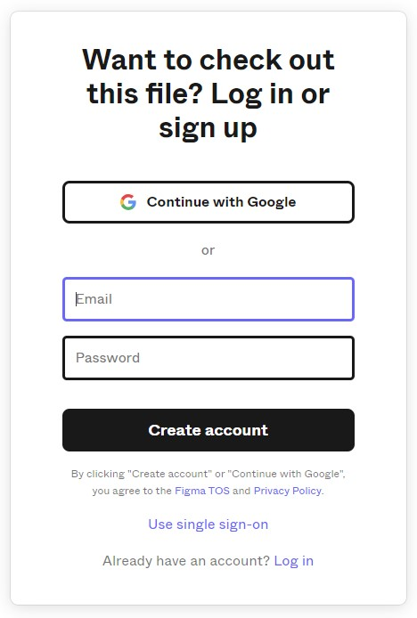

1. Follow the instructions. When you've finished you may see a screen similar to the following, click *Continue to file*.

    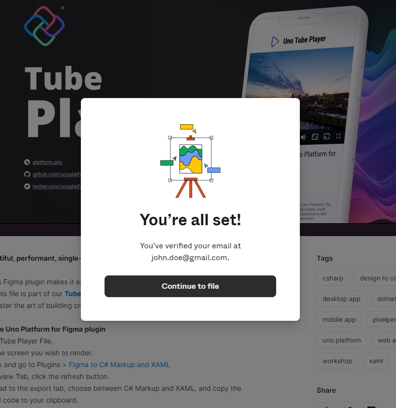

1. You may be asked additional questions but feel free to click *Skip* those that offer this option.

    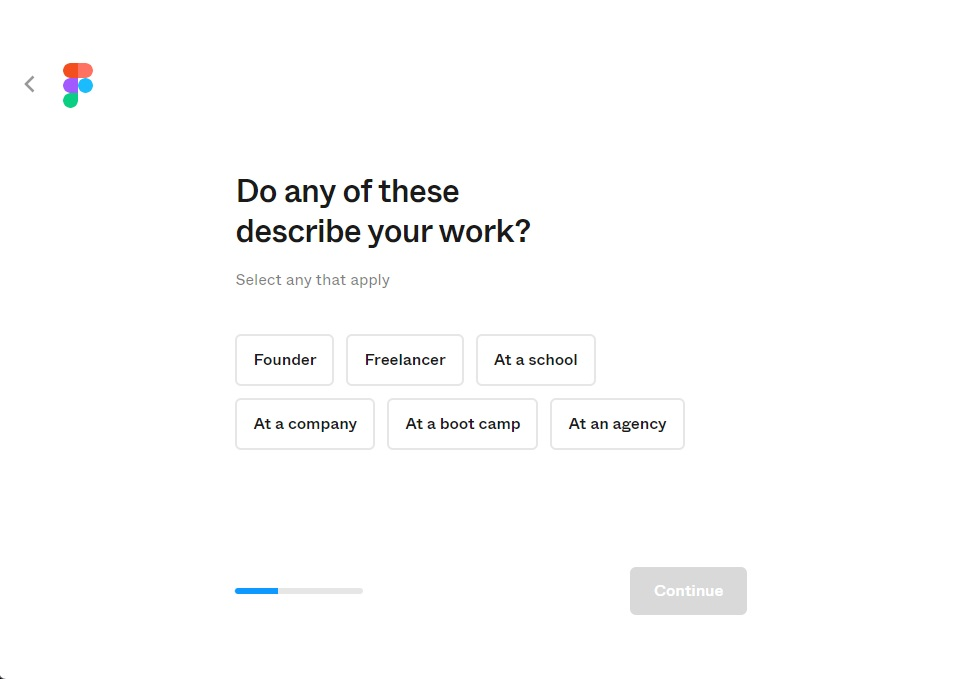

1. The Uno Tube Player design will open in Figma, displaying the Cover page:

    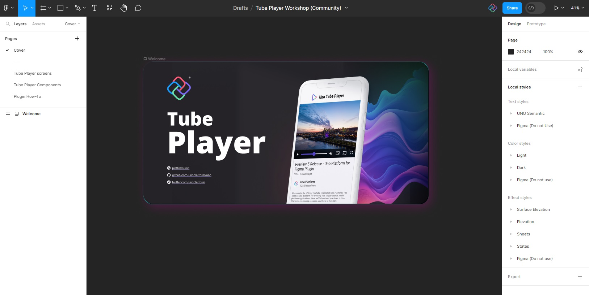

## Install the Uno Platform plugin for Figma

<!--
1. To export XAML or C# Markup from Figma, you'll need to install the Uno Platform plugin. To enable that you will need to create your own copy of the Uno Tube Player design.  
    In the top menu in the center of the screen click the little down arrow and select *Duplicate* or *Duplicate to your drafts* from the menu.

    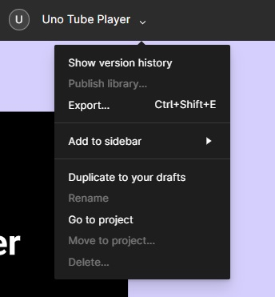 -->

1. Open the *Resources* menu (<kbd>Shift</kbd>+<kbd>I</kbd>) and navigate to the *Plugins* tab:

    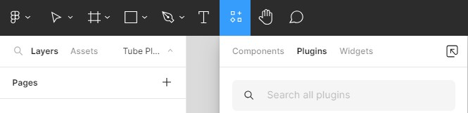

1. Search and install the *Uno Platform (Figma to C# or XAML)* plugin.

<!-- TODO: Add instructions to install export to C# Markup plugin https://github.com/unoplatform/workshops-private/issues/37 -->

1. Launch the plugin by clicking the *Uno Platform (Figma to C# or XAML)* plugin.

## Enable navigation in the plugin

The plugin comes with various features and settings. As you will be using the Uno Navigation extension in the Tube Player app (in [module 7](xref:Workshop.TubePlayer.Navigation)), enable the Navigation feature in Figma, so that the appropriate navigation settings are included with the generated C# Markup.

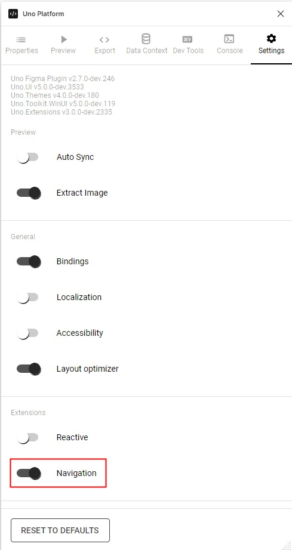

## MainPage - Video feed

### Export C# Markup from Figma using the Uno Platform plugin

1. All pages designed in the Uno Tube Player design in Figma are listed in the left-side navigation bar. Select *Tube Player screens* (you may need to scroll down a bit), then select the *1.0 Video feed* screen on the page or the submenu which will open at the bottom of the sidebar.  
    This screen will be used to generate the C# Markup of the `MainPage` in TubePlayer app.

    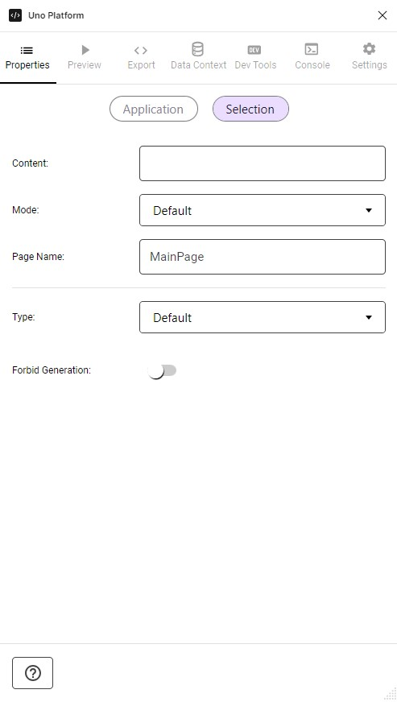

1. If you closed the plugin you can open it by right-clicking the screen, then clicking *Plugins* → *Development* → *Uno Platform*.

    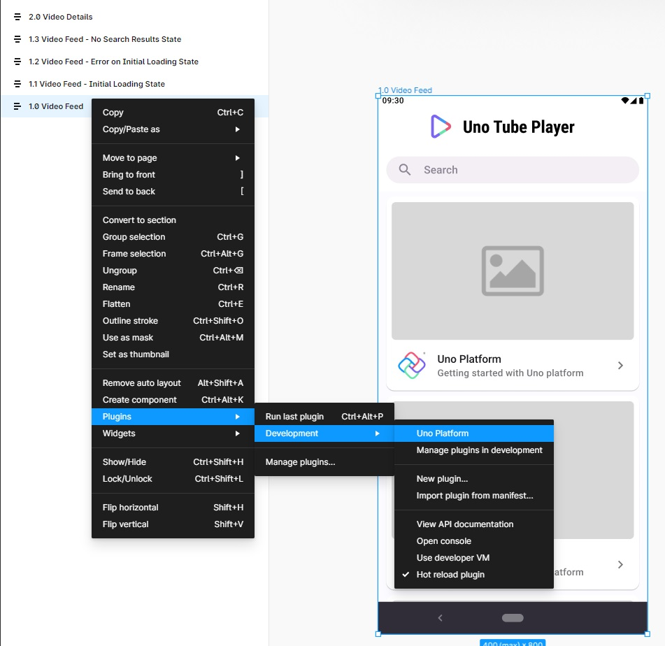

1. Open the *Export* tab, select *C#* from the dropdown, then click *Refresh* (the circled arrow button on the bottom).

    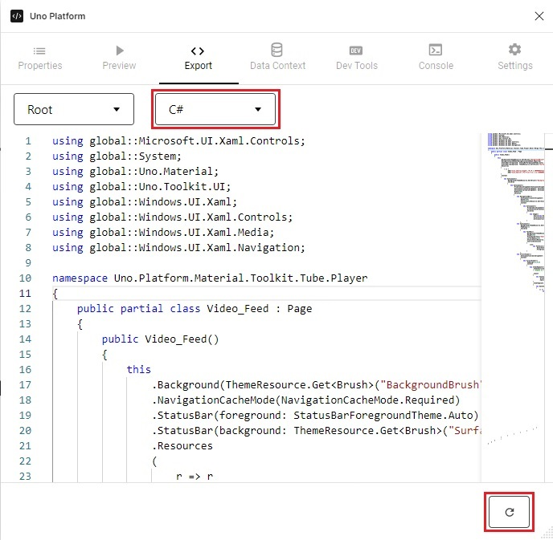

    Feel free to compare and examine the generated XAML and its C# Markup counterpart.

1. Select all contents (<kbd>Ctrl</kbd>+<kbd>A</kbd> on Windows).

    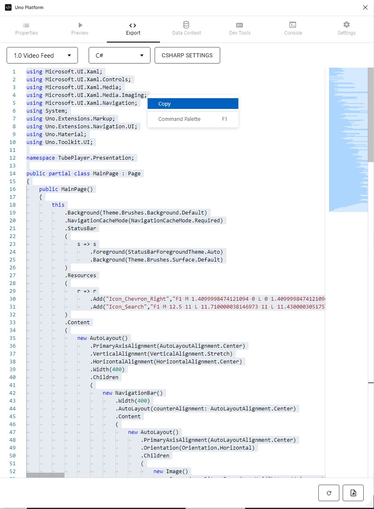

    <details>
        <summary><i>MainPage</i> code contents (collapsed for brevity)</summary>

    [!code-csharp[MainPage.cs](MainPage.cs)]
    </details>

1. Copy the selected code to the clipboard (<kbd>Ctrl</kbd>+<kbd>C</kbd> on Windows).

### Import C# Markup to the Tube Player project

1. Open *MainPage.cs* and replace all contents with the copied code.

1. Wrap the code with the `DataContext` extension method yet again (remember to add a closing parenthesis to the end):

    ```diff
     public sealed partial class MainPage : Page
     {
         public MainPage()
         {
    +        this.DataContext<BindableMainModel>((page, vm) => page
                 .Background(ThemeResource.Get<Brush>("BackgroundBrush"))
     
                    ...
    +        ));
         }
     }
    ```

1. In the following steps you'll replace the loosely-typed bindings generated by Figma with strongly-typed ones. For example, instead of `.ItemsSource(b => b.Bind("VideoSearchResults"))`, we'll use `.ItemsSource(() => vm.VideoSearchResults)`, where `vm` refers to the `vm` argument provided by the `DataContext` extension in the code you've just added in the previous step.
    By the way, we plan to introduce strongly-typed bindings in the Figma plugin, so stay tuned!

1. Replace the binding of the search-term *TextBlock*, in the following manner:

    ```diff
    -.Text(b => b.Bind("SearchTerm").TwoWay())
    +.Text(b => b.Bind(() => vm.SearchTerm).TwoWay().UpdateSourceTrigger(UpdateSourceTrigger.PropertyChanged))
    ```

1. Replace the binding of the *ListView* in the following manner:

    ```diff
    -.ItemsSource(b => b.Bind("VideoSearchResults"))
    +.ItemsSource(() => vm.VideoSearchResults)
    ```

1. Set the `ItemTemplate` extension method to a strongly typed one by providing the `YoutubeVideo` type argument:

    Update this:

    ```diff
    -.ItemTemplate
    -(
    -    () =>
             new CardContentControl()
             ...
    ```

    With the following:

    ```diff
    +.ItemTemplate<YoutubeVideo>
    +(
    +    youtubeVideo =>
             new CardContentControl()
    ```

1. Replace the other bindings either manually or using a regular-expression based find and replace. You'll also use this method to replace the loosely-typed bindings in the *VideoDetailsPage* as well.
   To replace them using a regex search using Visual Studio or Visual Studio Code, press <kbd>Ctrl</kbd>+<kbd>H</kbd>, then toggle the *Use regular expressions* option on (<kbd>Alt</kbd>+<kbd>E</kbd>). Search for the following pattern:

    ```
    b\s+\=\>\s+b\.Bind\(\"([\w\.]+)\"\)
    ```

    And replace it with the following:

    ```
    () => youtubeVideo.$1
    ```

1. Replace all occurrences in the current *MainPage.cs* file (<kbd>Alt</kbd>+<kbd>A</kbd>):

    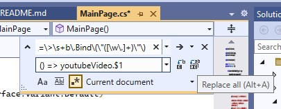

1. To avoid the nullability errors, either add [null-conditional operators](https://learn.microsoft.com/dotnet/csharp/language-reference/operators/member-access-operators#null-conditional-operators--and-) or [null-forgiving operators](https://learn.microsoft.com/dotnet/csharp/language-reference/operators/null-forgiving) after each nullable property access, or add the following to the beginning of the file (see [nullable references](https://learn.microsoft.com/dotnet/csharp/nullable-references#nullable-contexts)), for example:

    ```diff
    -.Source(() => youtubeVideo.Details.Snippet.Thumbnails.Medium.Url)
    +.Source(() => youtubeVideo.Details.Snippet?.Thumbnails?.Medium?.Url!)
    ```

    or

    ```csharp
    #nullable disable
    ```

## Video detail

### Export from Figma

1. Go back to Figma and select the *Video detail* screen.

1. If the Uno Platform plugin has closed, press <kbd>Ctrl</kbd>+<kbd>Alt</kbd>+<kbd>P</kbd> to reopen the plugin, or right-click the *Video detail* screen and select the plugin from the *Plugins* submenu.

1. Open the *Export* tab, select *C#* from the dropdown menu, then click *Refresh*.

1. Select and copy all code to the clipboard.

    <details>
        <summary><i>Video detail</i> code contents (collapsed for brevity)</summary>

    [!code-csharp[VideoDetailsPage.cs](VideoDetailsPage.cs)]
    </details>

1. Keep the Figma Uno Platform plugin window open, as you will access it in the upcoming module to download color theme overrides from it.

### Import to Tube Player project

1. Open the *VideoDetailsPage.cs* file, and replace it with the code in the clipboard.

1. Append a `DataContext` after `this.`:

    ```csharp
    .DataContext<BindableVideoDetailsModel>((page, vm) => page
    ```

    then add the closing parenthesis before the semicolon closing this method.

1. Update the bindings with strongly typed bindings as before.
    To utilize *Find and replace*, use the following regular-expressions. Search for this pattern:

    ```
    b\s+\=\>\s+b\.Bind\(\"([\w\.]+)\"\)
    ```

    and replace it with the following:

    ```
    () => vm.$1
    ```

1. Update the bindings here as well to avoid the nullability errors, either add nullability operators or disable nullable reference types, for example:

    ```diff
    -.Source(() => vm.Video.Channel.Snippet.Thumbnails.High.Url)
    +.Source(() => vm.Video.Channel.Snippet?.Thumbnails?.High?.Url!)
    ```

    or

    ```csharp
    #nullable disable
    ```

## Run the app

Run the app (<kbd>F5</kbd> on Visual Studio) and observe the UI changes, it should look similar to the following:

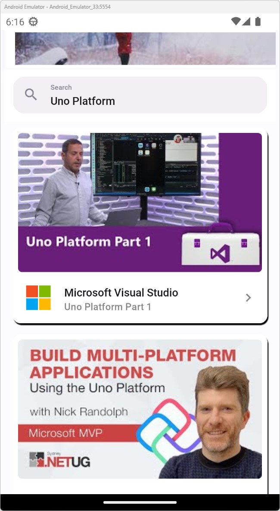

If you try tapping one of the videos in the list, an exception will occur. This is because navigation has not yet been implemented. You will address that in [Module 7 - Navigation](xref:Workshop.TubePlayer.Navigation).  
The image above the search page is a random image. It will be replaced in [Module 11 - App finalization](xref:Workshop.TubePlayer.Finalization)

## Next Step

[Module 5](xref:Workshop.TubePlayer.UI) offers an alternative way to import the UI code without Figma. Since you've already imported the UI, you may skip to Module 6, where you will adjust the UI you've imported by overriding the app's color theme.

**[Previous](xref:Workshop.TubePlayer.MockData "Connect UI with mock data")** | **[Next](xref:Workshop.TubePlayer.ThemeOverrides "Theme overrides")**
