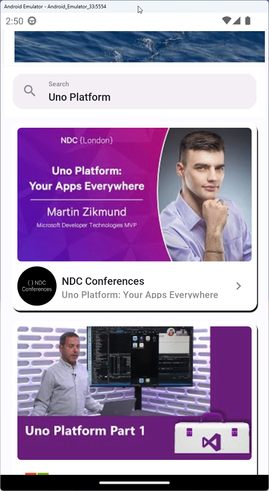

# Module 8 - Add API endpoints

In this module, you will substitute the mock service we created in [module 3](xref:Workshop.TubePlayer.MockData) with a service that interacts with real search results coming from YouTube.

For this module you'll need the Google API key you've obtained in the [first module](xref:Workshop.TubePlayer.GetStarted#[optional]-obtaining-a-youtube-api-v3-key).

## Obtain results from YouTube API

### The Uno Platform HTTP extension and Refit

To interact with the remote endpoints you will utilize the Uno Platform HTTP extension using Refit. This extension enables registering HTTP API endpoints with the Dependency Injection service collection. The endpoints can then be consumed from the service provider ready to use with pre-configured `HttpClient`s.  
[Refit](https://github.com/reactiveui/refit) takes it a step further and enables you to add attributes to your API endpoint contract interface methods, that contain instructions on how each method in the interface relates to a remote HTTP URL. When such an interface is requested from the DI service provider, it is automatically materialized with the instructions given via the Refit attributes, using the registered `HttpClient` configuration.

To learn more about these extensions, refer to the [HTTP extension docs](xref:Overview.Http).

### Install NuGet packages

Open the NuGet package manager for the *TubePlayer* project and install the following packages:

 - [`Uno.Extensions.Http.Refit`](https://www.nuget.org/packages?q=Uno.Extensions.Http.Refit)
 - [`Uno.Extensions.Http.WinUI`](https://www.nuget.org/packages?q=Uno.Extensions.Http.WinUI)

> [!NOTE]  
> HTTP can be included when generating the project by checking the *HTTP* option in the template wizard or CLI.  
> It was excluded so it can be added now manually for learning purposes.

### Add necessary models

Open the file *Services* → *Models* → *Models.cs* you've previously edited and append the following content to it:

    ```csharp

    public partial record IdData(string? VideoId);
    
    public partial record YoutubeVideoData(IdData? Id, SnippetData? Snippet);
    
    public record PageInfoData(int? TotalResults, int? ResultsPerPage);
    
    public record VideoSearchResultData(IImmutableList<YoutubeVideoData>? Items, string? NextPageToken, PageInfoData? PageInfo);
    ```

### Add Refit namespace

Add the following namespace to the *GlobalUsings.cs* file:

```csharp
global using Refit;
global using TubePlayer.Services;
```

### Create video search API endpoint

In the *Services* folder add a file called *IYoutubeEndpoint.cs* and replace its contents with the following:

<details>
    <summary><i>IYoutubeEndpoint.cs</i> code contents (collapsed for brevity)</summary>

```csharp
namespace TubePlayer.Services;

[Headers("Content-Type: application/json")]
public interface IYoutubeEndpoint
{
    [Get($"/search?part=snippet&maxResults={{maxResult}}&type=video&q={{searchQuery}}&pageToken={{nextPageToken}}")]
    [Headers("Authorization: Bearer")]
    Task<VideoSearchResultData?> SearchVideos(string searchQuery, string nextPageToken , uint maxResult, CancellationToken ct);

    [Get($"/channels?part=snippet,statistics")]
    [Headers("Authorization: Bearer")]
    Task<ChannelSearchResultData?> GetChannels([Query(CollectionFormat.Multi)] string[] id, CancellationToken ct );

    [Get($"/videos?part=contentDetails,id,snippet,statistics")]
    [Headers("Authorization: Bearer")]
    Task<VideoDetailsResultData?> GetVideoDetails([Query(CollectionFormat.Multi)] string[] id, CancellationToken ct );
}
```
</details>

The attributes in this interface are the Refit instructions on how to interact with the API. In the following step, you will set up Refit with the DI container.

### Create a class to hold the endpoint Refit options

Add another class (in the *Services* folder) called *YoutubeEndpointOptions.cs* with the following content:

```csharp
namespace TubePlayer.Services;

public class YoutubeEndpointOptions : EndpointOptions
{
    public string? ApiKey { get; init; }
}
```

### Add another implementation of `IYoutubeService`

In the *Business* folder add a file named *YoutubeService.cs* with the following content:

<details>
    <summary><i>YoutubeService.cs</i> code contents (collapsed for brevity)</summary>

[!code-csharp[YoutubeService.cs](YoutubeService.cs)]
</details>

### Add app settings

1. Under the project, open the file *appsettings.development.json* (cascaded under *appsettings.json* in Visual Studio Solution Explorer) and replace its contents with the following:

    ```javascript
    {
        "AppConfig": {
            "Title": "TubePlayer"
        },
        "YoutubeEndpoint": {
            "Url": "https://youtube.googleapis.com/youtube/v3",
            "ApiKey": "your_development_api_key",
            "UseNativeHandler": true
        },
        "YoutubePlayerEndpoint": {
            "Url": "https://www.youtube.com/youtubei/v1",
            "UseNativeHandler": true
        }
    }
    ```
    
    These settings are loaded as part of the app configuration. Read more at the Uno Platform [Configuration overview](xref:Overview.Configuration).

1. You can spot the `ApiKey` setting above, replace its value (`your_development_api_key`) with the API key you obtained from Google API in [Module 1](xref:Workshop.TubePlayer.GetStarted#optional-obtaining-a-youtube-data-api-v3-key).

### Register services

1. Let's instruct our app to use HTTP and tell it about the Refit client. In the *App.cs* file, add the following section after the `UseSerialization` call's closing parentheses:

    ```csharp
    .UseHttp(configure: (context, services) =>
    {
        services.AddRefitClientWithEndpoint<IYoutubeEndpoint, YoutubeEndpointOptions>(
            context,
            configure: (clientBuilder, options) => clientBuilder
                .ConfigureHttpClient(httpClient =>
                {
                    httpClient.BaseAddress = new Uri(options!.Url!);
                    httpClient.DefaultRequestHeaders.Add("x-goog-api-key", options.ApiKey);
                }));
    })
    ```

1. As you can see, there is no actual implementation of `IYoutubeEndpoint`, Refit takes care of that and provides a proxy class with all functionality needed, based on the attributes provided on the interface.
 
    The `YoutubeEndpointOptions` are automatically materialized with the values under the `YoutubeEndpoint` key in the *appsettings.json* file.  
    Read [this](https://cloud.google.com/docs/authentication/api-keys#using-with-client-libs) if you want to learn more about using Google API keys in web requests from client libraries.

    > [!TIP]  
    > There are additional overloads to the `AddRefitClient` extension, the one above uses the `AddRefitClientWithEndpoint` variation. This is necessary as we need to configure the `HttpClient` with an additional header containing the API key for YouTube to authorize the request and respond with search results. You'll use the `AddRefitClient` overload in [module 9 - add media player](xref:Workshop.TubePlayer.MediaPlayer#register-refit-endpoint).  

1. Replace the service registration for `YoutubeServiceMock` we added earlier with the new `YoutubeService` we just created:

    ```csharp
                    .ConfigureServices((context, services) =>
                    {
                        // Register your services
    #if USE_MOCKS
                        services.AddSingleton<IYoutubeService, YoutubeServiceMock>();
    #else
                        services.AddSingleton<IYoutubeService, YoutubeService>();
    #endif
                    })
    ```

    The `USE_MOCKS` [pre-processor directive](https://learn.microsoft.com/dotnet/csharp/language-reference/preprocessor-directives) allows you to control whether you want to run the app using the mock service or the one we've just implemented.

### Update feed to support pagination

1. Replace the `VideoSearchResults` feed in *MainModel.cs* with this one, which supports pagination by cursor:

    ```csharp
    public IListFeed<YoutubeVideo> VideoSearchResults => SearchTerm
    	.Where(searchTerm => searchTerm is { Length: > 0 })
    	.SelectPaginatedByCursorAsync(
    		firstPage: string.Empty,
    		getPage: async (searchTerm, nextPageToken, desiredPageSize, ct) =>
    		{
    			var videoSet = await YoutubeService.SearchVideos(searchTerm, nextPageToken, desiredPageSize ?? 10, ct);
    
    			return new PageResult<string, YoutubeVideo>(videoSet.Videos, videoSet.NextPageToken);
    		});
    ```

    Read more about MVUX pagination [here](xref:Overview.Mvux.Advanced.Pagination).

1. Import this namespace if it has not been added automatically already:

    ```csharp
    using Uno.Extensions.Reactive.Sources;
    ```

### Run the app

1. When you run the app, you will now see that the results are coming from YouTube.

1. Feel free to change around the search term to see it updating.  

1. Scroll down to load additional infinite results from YouTube.

1. Try several searches to see how the app displays search results from YouTube. However, if you clear the search box, an empty screen will show up, whereas we'd instead want a pre-designed template to indicate that.

    

1. In addition, try switching off the internet access of the debugging device (for example, if you're using Android Emulator turn on flight mode), then perform a search:

    

## Next step

In the next module, you'll learn how to utilize the `FeedView` control and customize its templates to adapt to such scenarios.

**[Previous](xref:Workshop.TubePlayer.Navigation "Navigation")** | **[Next](xref:Workshop.TubePlayer.FeedView "FeedView None and Error templates")**