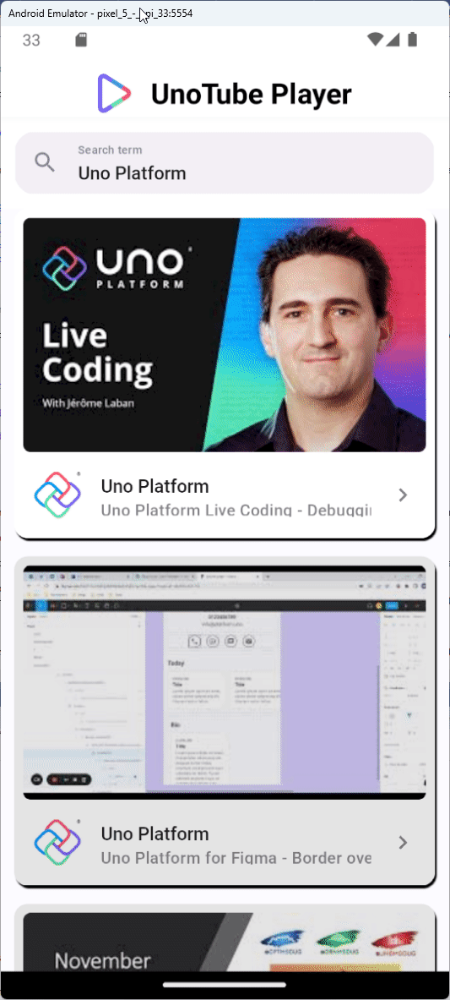

# Module 10 - Add a media player

In this module, you'll download streaming video data from YouTube and integrate into the app a media player element that can play it.  
You'll also learn how to interact with the media player and stop the video when navigating away from the video player page.

## Add YouTube video streaming endpoint API

1. Open the folder *Services/Models* and add a file named *PlayerModels.cs* with the following content:

    ```csharp
    public partial record Format(string? Url, string? QualityLabel);
    
    public partial record StreamingData(List<Format>? Formats);
    
    public partial record YoutubeData(StreamingData? StreamingData);
    ```

1. Add a file named *IYoutubePlayerEndpoint.cs* to the *Services* folder with the following content:

    ```csharp
    [Headers(
        "Content-Type: application/json",
        "User-Agent", "com.google.android.youtube/17.36.4 (Linux; U; Android 12; GB) gzip")]
    public interface IYoutubePlayerEndpoint
    {
        [Post("/player")]
        Task<ApiResponse<YoutubeData>> GetStreamData([Body] string data, CancellationToken cancellationToken = default);
    }
    ```

## Register Refit endpoint

The previous interface is a Refit service. You will now register it with Refit. Open *App.cs*, and add the following Refit client registration right after the previous one you added earlier:

```diff
 services
     .AddRefitClientWithEndpoint<IYoutubeEndpoint, YoutubeEndpointOptions>(
         context,
         configure: (clientBuilder, options) => clientBuilder
             .ConfigureHttpClient(httpClient =>
             {
                 httpClient.BaseAddress = new Uri(options!.Url!);
                 httpClient.DefaultRequestHeaders.Add("x-goog-api-key", options.ApiKey);
             }))
+    .AddRefitClient<IYoutubePlayerEndpoint>(context);
```

## Utilize `IYoutubePlayerEndpoint` in `VideoDetailsModel`

1. Open the file *VideoDetailsModel.cs* and add a property of type `IYoutubePlayerEndpoint` named `YoutubeClient` to it (via the record constructor, like the `Video` property).

1. Add the following method to the record:

    ```csharp
    private async ValueTask<MediaSource> GetVideoSource(CancellationToken ct)
    {
        var streamVideo = 
            $$"""
            {
                "videoId": "{{Video.Id}}",
                "context": {
                    "client": {
                        "clientName": "ANDROID_TESTSUITE",
                        "clientVersion": "1.9",
                        "androidSdkVersion": 30,
                        "hl": "en",
                        "gl": "US",
                        "utcOffsetMinutes": 0
                    }
                }
            }
            """;
    
        // Get the available stream data
        var streamData = await YoutubeClient.GetStreamData(streamVideo);
    
        // Get the video stream with the highest video quality
        var streamWithHighestVideoQuality = streamData.Content?.StreamingData?.Formats?.OrderByDescending(s => s.QualityLabel).FirstOrDefault() ??
            throw new InvalidOperationException("Input stream collection is empty.");
    
        // Get the stream URL
        var streamUrl = streamWithHighestVideoQuality.Url;
    
        // Return the MediaSource using the stream URL
        return MediaSource.CreateFromUri(new Uri(streamUrl!));
    }
    ```

1. Replace the `VideoSource` property declaration line with the following one:

    ```csharp
    public IFeed<MediaSource> VideoSource => Feed.Async(GetVideoSource);
    ```

## Add player to layout

1. Open the *VideoDetailsPage.cs* file, and add the following variable to the top of the file (right after class opening):

    ```csharp
    private MediaPlayerElement? youtubePlayer;
    ```

1. Add the `Assign` extension method to the `MediaPlayerElement`, so that it can be accessed outside this scope, as well as the `AutoPlay` and `Source` extension methods:

    ```diff
     new MediaPlayerElement()
    +    .Assign(mediaPlayerElement => youtubePlayer = mediaPlayerElement)
    +    .AutoPlay(true)
    +    .Source(() => vm.VideoSource)
    +    .PosterSource(() => vm.Video.Details.Snippet?.Thumbnails?.Medium?.Url!)
         ...
    ```

## Pause the video when returning to the search results page

When the user navigates back to the search results page, the media player continues to play the video. To avoid that, implement the `OnNavigatingFrom` method in *VideoDetailsPage.cs* as follows:

```csharp
protected async override void OnNavigatingFrom(NavigatingCancelEventArgs e)
{
    base.OnNavigatingFrom(e);

    YoutubePlayer.MediaPlayer.Pause();
}
```

## Install additional NuGet packages for WASM and Skia.GTK

Open the NuGet package manager for the *TubePlayer.WASM* project and install the following packages:

- [`Uno.WinUI.MediaPlayer.WebAssembly`](https://www.nuget.org/packages/Uno.WinUI.MediaPlayer.WebAssembly)

Open the NuGet package manager for the *TubePlayer.Skia.GTK* project and install the following packages:

- [`Uno.WinUI.MediaPlayer.Skia.Gtk`](https://www.nuget.org/packages/Uno.WinUI.MediaPlayer.Skia.Gtk)
- [`VideoLAN.LibVLC.Windows`](https://www.nuget.org/packages/VideoLAN.LibVLC.Windows)

## Run the app

Run the app to see the media player playing the video from YouTube. Seek, volume, pause, and other controls are built into the media player.



You will notice how the video stops before navigating back to the search results (observe the play button right before the navigation happens), but at the same time, we still want to update the navigation bar image (currently a random picture), the app icon, as well as the splashscreen (which are currently set to the template defaults).

> [!NOTE]
> In order to be able to play the media in WASM, because of a CORS issue, you will need to either create a server project (e.g. using [YARP](https://chat.openai.com/share/d633a7b6-1b3c-4730-a60b-96dfd97baa0a)) or by using a public proxy (e.g. using [CORS Anywhere](https://github.com/Rob--W/cors-anywhere)).

For more information on `MediaPlayerElement` support, refer to the [MediaPlayerElement documentation](https://aka.platform.uno/mediaplayerelement).

## Next step

**[Previous](xref:Workshop.TubePlayer.FeedView "FeedView None and Error templates")** | **[Next](xref:Workshop.TubePlayer.Finalization "App finalization")**
