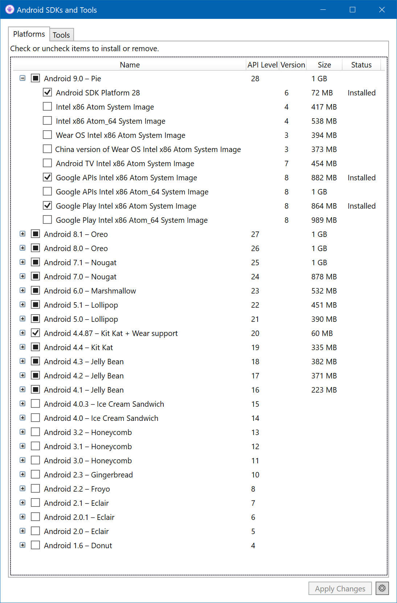
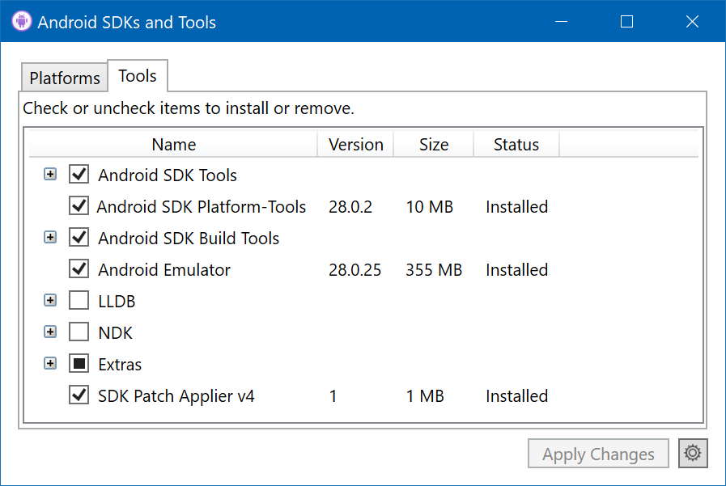

# Developer Environment Setup

## 📖 Overview

Developing applications with the Uno Platform requires Visual Studio for Windows. On iOS and Android, the Uno Platform relies extensively on the Xamarin Native stack. On WebAssembly, the Uno Platform relies directly on the Mono-Wasm runtime.

If you are doing this workshop as part of a classroom, it is important to pre-install these components of Visual Studio for Windows before attendance, as you'll need to download upwards of 12Gb of software from Microsoft.

## ☑️ Software Installation

Attendees will need a Windows 10 (version 1903 or higher recommended) computer with the following software installed:

* [ ] [Visual Studio for Windows 2019](https://visualstudio.microsoft.com/vs/) 16.2.0 or higher (any edition) with the following workloads installed:
  * .NET desktop development
  * Universal Windows Platform development
  * Mobile development with .NET
  * ASP.NET and web development
  * Node.js development
  * Visual Studio extension development
  * .NET Core cross-platform development
  * Individual components:
    * .NET / .NET Framework 4.6.2 SDK
    * .NET / .NET Framework 4.6.2 targeting pack
    * Code tools / Git for Windows
    * SDKs, librairies, and frameworks / Windows 10 SDK (10.0.16299.0)
    * SDKs, librairies, and frameworks / Windows 10 SDK (10.0.17763.0)
    * SDKs, librairies, and frameworks / Windows 10 SDK (10.0.18362.0)
    * Emulators / Intel Hardware Accelerated Execution Manager (HAXM)  -- if you have an Intel processor

* [ ] [.NET Core 2.2 SDK](https://dotnet.microsoft.com/download)

* [ ] Android SDKs and Tools with the following components installed in the [Android SDK Manager](https://docs.microsoft.com/en-us/xamarin/android/get-started/installation/android-sdk?tabs=windows) via `Visual Studio for Windows -> Tools -> Android -> Android SDK Manager`.

* [ ] Platforms
  * [ ] Android 9.0 (Pie) API 28
  * [ ] Android 8.1 (Oreo) API 27
  * [ ] Android 8.0 (Oreo) API 26

* [ ] Tools
  * [ ] Android SDK Tools (ensure latest)
  * [ ] Android Platform Tools (ensure latest)
  * [ ] Android SDK Build Tools (ensure latest for all)
  * [ ] Android Emulator (ensure latest)

* [ ] [Uno Platform Solution Templates](https://marketplace.visualstudio.com/items?itemName=nventivecorp.uno-platform-addin)
* [ ] [Google Chrome](https://chocolatey.org/packages/GoogleChrome), [Firefox](https://chocolatey.org/packages/firefox), [FireFox Developer Edition](https://chocolatey.org/packages/firefox-dev) and [Microsoft Edge Insider](https://www.microsoftedgeinsider.com/en-us/)

## ☑️ Configuration

* [ ] [Developer Mode in Windows 10 enabled](https://docs.microsoft.com/en-us/windows/uwp/get-started/enable-your-device-for-development)
* [ ] [Windows Hypervisor Platform](https://docs.microsoft.com/en-us/xamarin/android/get-started/installation/android-emulator/hardware-acceleration?tabs=vswin&pivots=windows#hyper-v) must be activated.

## What's next

🎉 that's it. Your computer is now setup to do software development with the Uno Platform. In the [next module][next-module] you'll learn all about the Uno Platform and build your first application via the Uno Solution Template generator.

<!-- in-line links -->
[next-module]: ../01-Introduction-to-Uno/README.md
