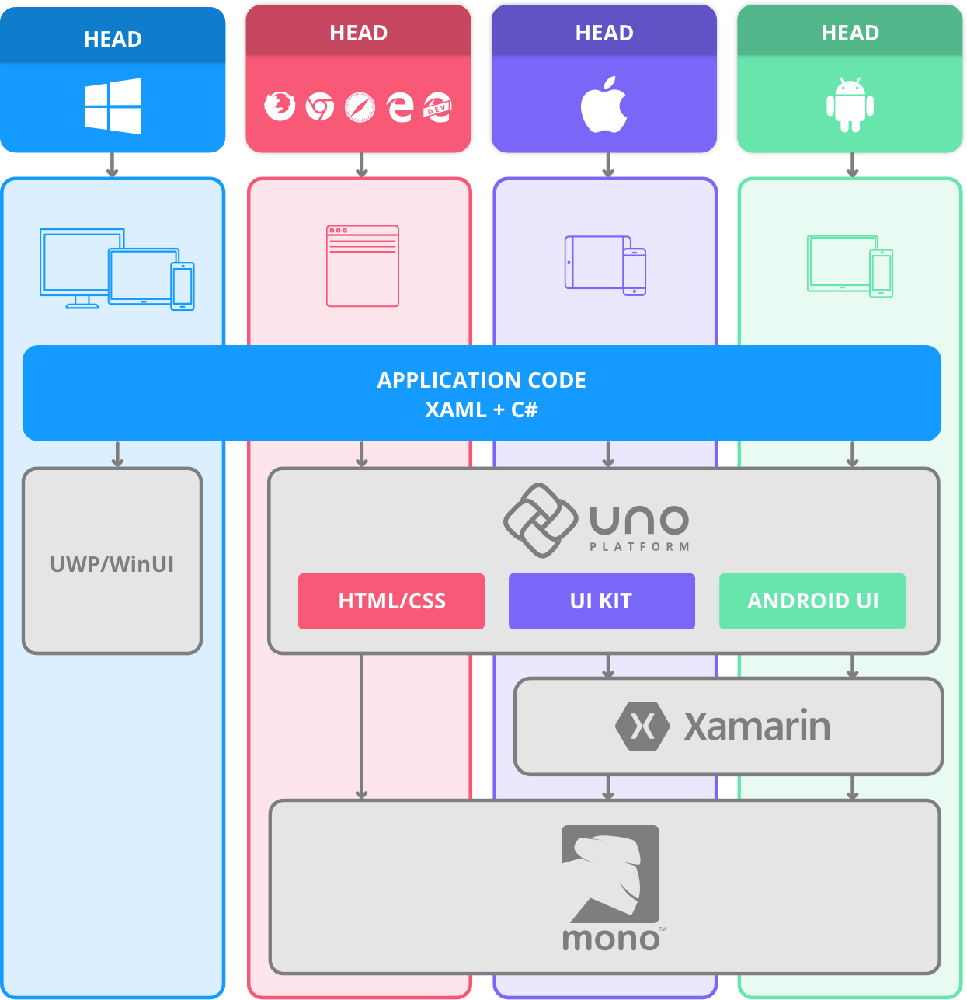
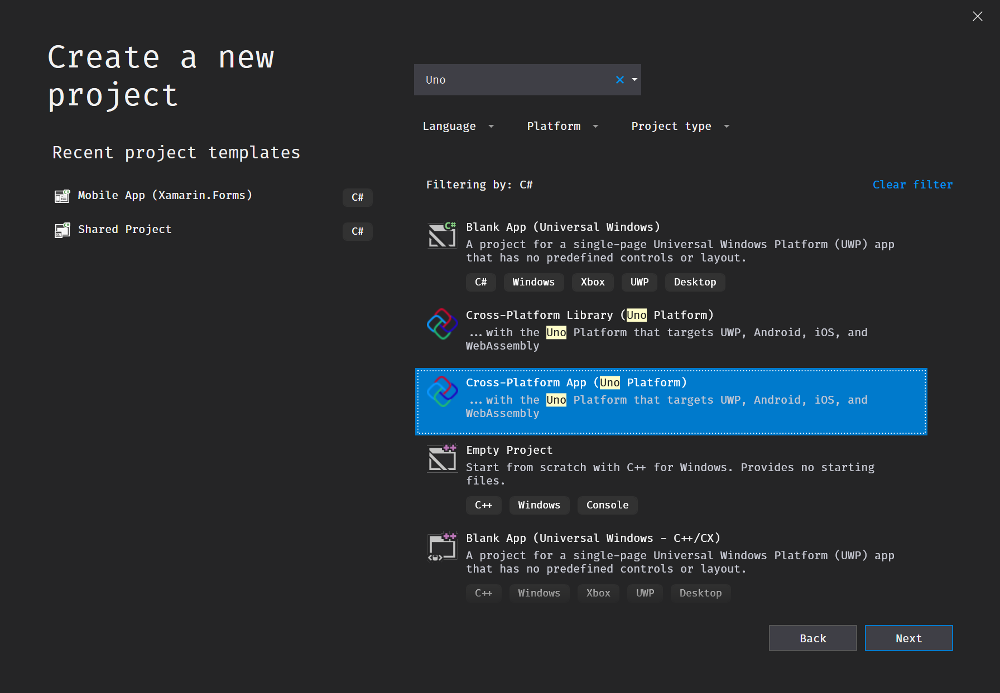
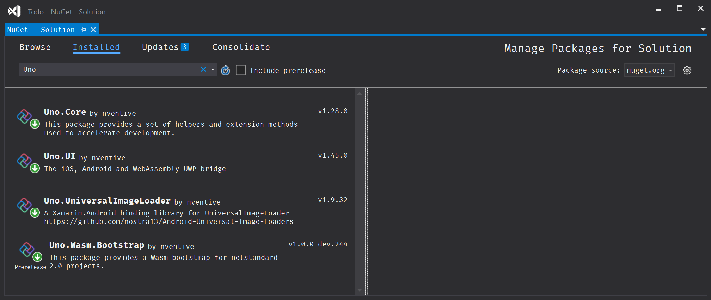

# Introduction to Uno

## 📖 Overview

This workshop provides a walk-through of the basics of creating an application with the [Uno Platform][uno-platform]. Each module contains some background information on major features and concepts in the Uno Platform and includes activities to apply what you have learned.

By the end of this module, you will:

- Confirm your computer is configured correctly and has the correct software installed.
- Use the Uno Platform Solution Templates to generate an application.
- Learn what the Uno Platform is and how it is not a complete replacement of native UI frameworks.
- Understand the project structure Uno uses, the reasons why, and terminology.
- Understand the purpose of each NuGet package of the Uno Platform and what's inside of them.

## ✋ Before You Begin

You need to have Visual Studio for Windows, and the Uno Platform Solution Templates installed. Additionally, Developer Mode in Windows 10 must be enabled. It is assumed that you have downloaded, installed, and configured your computer as per the checklist [found in the previous module][previous-module]. If you are doing this workshop as part of a classroom, it is important to pre-install these components of Visual Studio for Windows before attendance as you'll need to download upwards of 12Gb of software from Microsoft.

## 💡 What is the Uno Platform

The [Uno Platform][uno-platform] is a Universal Windows Platform Bridge that allows UWP-based code (C# and XAML) to run on iOS, Android, and WebAssembly. It provides the full API definitions of the UWP Windows 10 October 2018 Update (build 17763), and the implementation of parts of the UWP API, such as `Windows.UI.Xaml`, to enable UWP applications to run on these platforms.

### Why Uno

Developing for Windows (phone, desktop, tablet, XBox), iOS (tablet and phone), Android (tablet and phone) and WebAssembly at once can be a complex process, especially when it comes to the user interface. Each platform has its own ways of defining dynamic layouts, with some being more efficient, some more verbose, some more elegant, and some more performant than others.

Yet, being able to master all these frameworks at once is a particularly difficult task, because of the amount of platform-specific knowledge required to master each platform. Most of the time it boils down to different teams developing the same application multiple times, with each requiring a full development cycle.

With Xamarin, C# comes to all these platforms; however, it only provides transparent translations of the UI frameworks available for iOS and Android. Most non-UI code can be shared, but when it comes to the UI, almost nothing can be shared.

To avoid having to learn the UI-layout techniques and approaches for each platform, the Uno Platform mimics the Windows XAML approach of defining UI and layouts. This translates into the ability to share styles, layouts, and data-bindings while retaining the ability to mix XAML-style and native layouts.

It is incredibly easy to mix UWP view types with purely native views. For instance, a `StackPanel` can contain a `RelativeLayout` on Android or an `MKMapView` on iOS.

This is possible because, in the Uno Platform, all views inherit from the native base view type. On Android, this means `View`. On iOS, this means `UIView`. Since Uno couldn't change the design of the iOS or Android frameworks, Uno made `DependencyObject` an interface with an implementation that is automatically supplied by [code generation][source-generator]. This design decision allows an Uno `FrameworkElement` to be a `View` or `UIView` and at the same time to be a `DependencyObject`.

In summary, the Uno Platform provides the ability for developers to reuse known layout and coding techniques on all platforms, resulting in a gain of overall productivity when creating UI-rich applications. On iOS and Android, the Uno Platform relies extensively on the Xamarin Native stack. On WebAssembly, the Uno Platform relies directly on the Mono-Wasm runtime.

### What does Uno not do

The Uno Platform is not meant to be a complete replacement of all the native UI frameworks. This would be the lowest-denominator approach and would result in end-users noticing the non-native appearance or behavior of an application on their device. Having an iOS application that behaves like an Android application may bother users.

Instead the Uno Platform provides a common set of layout and controls, designed to provide the ability to share an important part of an application's code and markup; however, it leaves developers with the ability to retain the native look and feel. At the same time, it provides a way to have a pixel-perfect UI and UX being identical on all platforms. Commonly, this look and feel will be found in the navigation, transitions and animations, main pages, and edges of the screen.

## 🎯 Create a Cross-Platform App (Uno Platform)

> 🛈 If you cannot find the Cross-Platform App (Uno Platform) template, then the Uno Platform Solution Templates may not be installed. You'll find instructions where you can download them from [in the previous module][previous-module].

1. Launch Visual Studio for Windows (any edition).
2. Navigate to `File -> New -> Project`.
3. Search for `Uno`.
4. Select `Cross-Platform App (Uno Platform)`.
5. Name the Project name as `Todo`.
6. Specify the Location as a folder in the workshop git repository.
7. Press `Create` to generate your Uno application.
8. Make sure to add Newtonsoft.Json package to all heads, and Uno.Wasm.WebSockets to the Wasm head.

## 💡 Project Structure

You now have a `Todo.[Droid|iOS|UWP|Wasm]` project for each platform that Uno supports:

- Universal Windows Platform (UWP).
- Android.
- iOS.
- WebAssembly.

These projects are commonly referred to by the Uno Platform team as `platform heads`. They contain typical information like settings, metadata, dependencies, and also a list of files included in the project. The `platform head` builds and packages the binary executable for that platform.

You also now have a `shared project` (`Todo.Shared`) which contains files that are shared between all of the `platform heads`. Clearly understanding how `shared projects` work is important to using the Uno Platform effectively. They are nothing more than a list of files.

Let's repeat that for emphasis:

> ❗️ In Visual Studio, a shared project is just a list of files. Referencing a shared project in an ordinary `.csproj` project causes those files to be included in the project. They're treated in exactly the same way as the files inside the project.

It's important to be aware that the code in a shared-project file is compiled separately for each `platform head`. If you add a `netstandard` NuGet package such as `Json.NET` to a `platform head` and forget to add it to the other `platform heads` then those `platform heads` won't compile until you add the package.

Here's the rule of thumb (tm):

- Bootstrapping code, packaging settings, and platform-specific code goes in the corresponding `platform head`.
- Your business logic goes into the `shared project` or in a `netstandard20` project.
- Your user interface goes into the `shared project`.
- String resources normally go in the `shared project`.
- Image assets may go either in the `shared project` or under each `platform head`.
- Font assets must be placed in each `platform head`.
- NuGet packages must be added to each `platform head` unless that package enables `platform head` functionality and in which case, install the package into just that `platform head`.

## 🎯 Update Dependencies

1. Right Click `Solution 'Todo'` in Solution Explorer
2. Click `Manage NuGet Packages for Solution`
3. Navigate to the Updates tab
4. Update `Uno.UI`
5. Update `Uno.Core`
6. Update `Uno.UniversalImageLoader`
7. Update `Uno.Wasm.Bootstrap`

## 💡 Uno Platform Dependencies

### Uno.Core

Low-level foundation for the implementation of Uno.UI. It's basically a bunch of patterns and method extensions used for logging, threading, tracing, etc...

[Sources][uno-core-sources]

### Uno.UI

This is the main part of Uno.UI. It not only contains an implementation of controls on all supported platforms, but also a code generator and even a _code analyzer_ to help developers when they are using it.

[Sources][uno-ui-sources] /
[Documentation][uno-ui-docs]

### Uno.UniversalImageLoader

This is the Xamarin.Android binding library for the excellent nostra13's [`UniversalImageLoader`](https://github.com/nostra13/Android-Universal-Image-Loader) to improve the performance of image loading on Android.

The usage of this package is optional, but there's no good reason to remove it except if you want to implement your own image loader.

[Sources][img-loader-sources]

### Uno.Wasm.Bootstrap

This is for wasm. It's a toolkit done by Uno to run .NET code in a browser using Mono-Wasm easily.

[Sources & documentation][uno-wasm-sources]

### Uno.CodeGen

This is an optional dependency, and we recommend that you use it. It supplies utilities to make immutable classes in C# and automate the code for comparisons.

[Sources & documentation][uno-codegen-sources]

## 📚 Additional Reading Material

- [The Uno Platform Website][uno-platform]
- [The Philosophy of Uno][philosophy-of-uno]
- [Overview of the Uno Source Generator][source-generator]
- [Platform-specific C# code][platform-specific-csharp]
- [Platform-specific XAML markup][platform-specific-xaml]

## ⏭️ What's next

In [the next module][next-module] you'll learn about the philosophy of the Uno Platform, which had guided the development of past and future architectural decisions. Each module from here onwards teaches you about each philosophical tenant and includes activities to apply what you have learned.

<!-- in-line links -->
[uno-platform]: https://platform.uno/

[previous-module]: ../00-Developer-Environment-Setup/README.md
[next-module]: ../02-Leverage-existing-tools/README.md

[philosophy-of-uno]: https://platform.uno/docs/articles/concepts/overview/philosophy-of-uno.html
[source-generator]: https://github.com/unoplatform/uno/blob/ea91df3bccce4dc7ece863adb86721f63356c59d/doc/articles/concepts/source-generation.md
[platform-specific-xaml]: https://platform.uno/docs/articles/platform-specific-xaml.html
[platform-specific-csharp]: https://platform.uno/docs/articles/platform-specific-csharp.html

[uno-core-sources]: https://github.com/nventive/Uno.Core
[uno-ui-sources]: https://github.com/unoplatform/uno
[uno-ui-docs]: https://platform.uno/docs/articles
[img-loader-sources]: https://github.com/nventive/Binding.UniversalImageLoader
[uno-wasm-sources]: https://github.com/unoplatform/Uno.Wasm.Bootstrap
[uno-codegen-sources]: https://github.com/nventive/Uno.CodeGen
