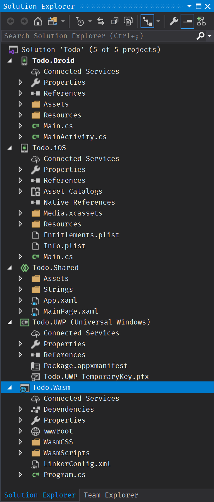
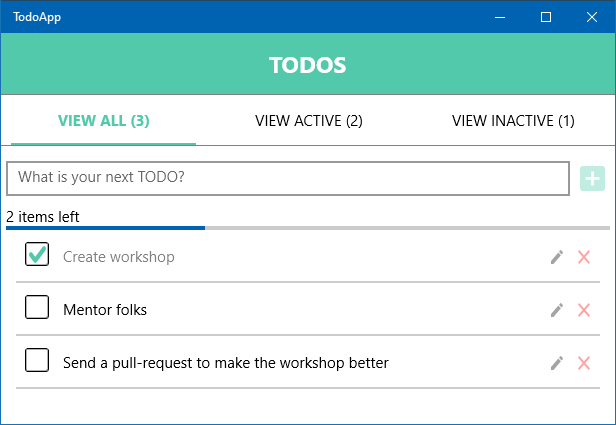

# Leverage Existing Tools

## 📖 Overview

One of the [philosophical tenants][philosophy-of-uno] of the [Uno Platform][uno-platform] is that wherever possible, the platform should `leverage existing tools` as Microsoft's tooling is a treat to work with. With the Uno Platform you can and should build your app with those tools as part of your inner-development loop with the Universal Windows Platform and then as part of your outer-development loop validate by deploying your application to iOS, Android, and the web via WebAssembly. 

In this module you'll be (re)introduced to three key tools and learn the most productive way to develop a application:

- [Edit and Continue][edit-and-continue].
- [Live Visual Tree][live-visual-tree].
- [XAML Hot Reload][xaml-hot-reload].

## 🎯 Start the application

1. Right click on the `Todo.UWP` application and select `Set as Startup Project`.
1. Right click on the `Todo.UWP` application and select `Deploy`.
1. Ensure the platform selector is set to `Todo.UWP`.
1. Navigate to `Debug -> Start Debugging` to launch the application.

<!-- E&C is currently broken in VS2019

## 🎯 Play with C# Edit and Continue

> 🛈️ [Edit and Continue][edit-and-continue] is a time-saving feature that enables you to make changes to your source code while your program is in break mode. When you resume execution of the program by choosing an execution command like `Continue` or `Step`, `Edit and Continue` automatically applies the code changes. This allows you to make changes to your code during a debugging session, instead of having to stop, recompile your entire program, and restart the debugging session.

1. Introduce people to feature, don't assume pre-existing knowledge.
1. Start up the UWP head of the Todo app in `DEBUG` mode (right click ->

-->

## 🎯 Play with Live Visual Tree

> 🛈 [Live Visual Tree][live-visual-tree] provides you with a real-time view of your running XAML code via the `Live Visual Tree` and the `Live Property Explorer`. These two tools give you a tree view of the UI elements of your running XAML application, and show you the runtime properties of any UI element you select.

## 🎯 Play with Windows Hot Reload

> 🛈️ [XAML Hot Reload][xaml-hot-reload] helps you build your UWP app user interface by letting you make changes to XAML code while your app is running. Hot Reload is available in both Visual Studio and Blend for Visual Studio. This feature enables you to incrementally build and test XAML code with the benefit of the running app's data context, authentication state, and other real-world complexity that is hard to simulate during design-time.

## 🎯 Play with Uno Hot Reload

## 📚 Additional Reading Material

- [The Uno Platform Website][uno-platform].
- [The Philosophy of Uno][philosophy-of-uno].
- [How to: Use Edit and Continue (C#)][edit-and-continue].
- [Write and debug running XAML code with XAML Hot Reload][xaml-hot-reload].
- [Inspect XAML properties while debugging][live-visual-tree].
- [TodoMVC][todomvc].

## ⏭️ What's next

In [the next module][next-module] you'll learn about the next philosophical tenant — `Let views, do views` and use the tools you just learned about to build the business logic of the infamous [TodoMVC code kata][todomvc] for the Universal Windows Platform, iOS, Android and WebAssembly from a single codebase in C#.

<!-- in-line links -->
[uno-platform]: https://platform.uno/

[previous-module]: ../01-Introduction-to-Uno/README.md
[next-module]: ../03-Let-views-do-views/README.md

[philosophy-of-uno]: https://platform.uno/docs/articles/concepts/overview/philosophy-of-uno.html

[edit-and-continue]: https://docs.microsoft.com/en-us/visualstudio/debugger/edit-and-continue-csharp
[live-visual-tree]: (https://docs.microsoft.com/en-us/visualstudio/debugger/inspect-xaml-properties-while-debugging)
[xaml-hot-reload]: https://docs.microsoft.com/en-us/visualstudio/debugger/xaml-hot-reload

[todomvc]: http://todomvc.com/
