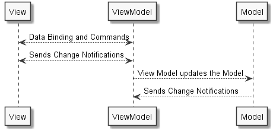

# Let views do Views

## 📖 Overview

The next [philosophical tenant][philosophy-of-uno] of the [Uno Platform][uno-platform] is that, wherever possible, the platform should `let views do views` as separation of model, view, and presentation keeps your code loosely coupled and easy to maintain. Features like data binding and attached properties let you write a clean, elegant MVVM-style code.

In this module, you'll be (re)introduced to the architectural pattern of `Model-View-ViewModel` and build the business logic for the infamous [TodoMVC code kata][todomvc] for Universal Windows Platform, iOS, Android and, WebAssembly from a single codebase in C#.

## 💡 Why we need Model-View-ViewModel

Unfortunately, most frameworks, including the Universal Windows Platform, didn't apply much thought to unit testing when the framework was designed, or those concerns were deemed as out-of-scope. As a result, user-interface objects are often very difficult to test in unit test runners, as they are not *plain objects* and frameworks often have dependencies on a run-loop existing, or often expect static classes/globals to be initialized in a certain way.

So, since user-interface classes are untestable via unit test runners, the goal with the `Model-View-ViewModel` design pattern is to put as much of your *interesting code*, into a class that *represents the View*, but is just a regular class we can create. Then, we want the actual code in the View to be
as boring, mechanical, and as short as possible, because it is inherently untestable.

This regular, testable class is called the `ViewModel`, and it is the *Model of a View*. A view is a composable piece of the UI that handles a particular and well-defined UI function on the page. This means that each *View will usually have one Viewmodel* to handle that function. This doesn't have to be strictly true, but it is generally the case.



Another important aspect of understanding ViewModels is that they are an abstraction to separate *policy* from *mechanism*. *ViewModels do not deal in the specifics of Buttons and Menus and TextBoxes, they only describe how the data in these elements are related*. For example, the "Copy" `ICommand` has no direct knowledge of the MenuItem or the Button that it is connected to, and it only models the *action* of Copying. The View has the responsibility of mapping the Copy command to the controls that invoke it.

### ViewModels are Reusable

Because `ViewModels` do not explicitly reference user interface frameworks or controls, this means that ViewModels can often be *reused across platforms*. This is a very powerful pattern that can drastically reduce the time required to port to a new platform.

### Common Mistakes and Misconceptions

Many people believe that the `Model-View-ViewModel` pattern means that there should be zero code in the View code-behind, or that everything should be in XAML. C# is a very expressive and concise language, and while it may be *possible* for you to create an entire complex View in XAML, at times, it's better to reach for C# for maintainability and readability reasons.

So then, how do you decide what to put in the View? Concepts such as scroll position and control focus are great examples of code that is View-specific. Handling animation and Window position / minimize are also great examples of code that often should be in the View.

Another common misconception is that of separation - while it is very important that the ViewModel has no reference to the View or any of the controls that the View creates, *the reverse is not true*. The View is free to be very tightly bound to the ViewModel, and in fact, it is often useful for the View to "reach into" the ViewModel.

## 🎯 Decompose the application domain model

The first step to mastering the Model-View-ViewModel software design pattern is learning to decompose user interfaces so here's what you'll be building over the next couple of modules — the infamous [TodoMVC][todomvc] application. If you have internet, please familiarize yourself with the application before proceeding.


<details><summary>1. 🎯 ☑️ Pause for a moment and deconstruct the application model. Validate your deconstruction by expanding this checklist.</summary>
<p>

There are nine concerns that require domain modeling:

1. [ ] A way to add items to the todo list.
2. [ ] A list of todo items.
3. [ ] Each todo item has a boolean status - incomplete or complete.
4. [ ] Each todo item has a description that can be changed.
5. [ ] Each todo item has a way to delete it.
6. [ ] A count of the number of incomplete items that remain.
7. [ ] A count of the total number of items.
8. [ ] Commands that filter the list of todo items - all, active, and completed.
9. [ ] A command that clears all completed items.

</p>
</details><br/>

Now that you have modeled the domain, it is time to think about what that the user can do with the application, state, and under what circumstances the user-interface will update automatically in response to interactions. Ignore concerns about data persistence at this stage.

<details><summary>2. 🎯 ☑️  Pause for a moment and deconstruct the application behaviour. Validate your deconstruction by expanding this checklist.</summary>
<p>

There are seven application behaviors:

1. [ ] When there are no items in the todo list - the majority of all controls are hidden.
2. [ ] When an item is added to the todo list — the item is added to the top of the list.
3. [ ] When an item is marked as complete — the todo item is struck out.
4. [ ] When an item is deleted — the todo item disappears.
5. [ ] When the boolean status of todo item changes — the number of todo items left updates automatically.
6. [ ] The buttons filter the todo list — display all, display only active and display only completed.
7. [ ] When the clear completed button is pressed — all completed items are removed from the todo list.

</p>
</details><br/>

## 💡 Data Binding and Commands

Data binding is how you attach user-interface elements to the application domain model. Data binding comes in three modes - `one time`, `one-way` and `two-way`:

* `one-time` is used when you need to display values when the user-interface is first shown, and there's no requirement to respond to changes to these values. If you need to display an image, such as an avatar of a user, then you'll typically use `one-time`.
* `one-way` is used when you need the user-interface to update when values change automatically. If you need to display a collection of items or anything that requires reactivity, then you'll typically use `one-way`. It is commonly the default.
* `two-way` is used when you need the user-interface to update the values and automatically update when the values change. If you need to accept user input to a text box and have that text box automatically update when the backing value changes then you'll typically use `two-way`.

In this module, you won't be doing any data-binding, but you'll implement commands that will handle events from the user interface. The interface for this is called `ICommand`, and we've provided you with implementation over at [TodoApp/TodoApp.Shared/ViewModels/SimpleCommand.cs][src-simplecommand] which you'll be using to build your application.

## 💡 Sending Change Notifications

When the value that a user-interface element is bound updates, the user-interface needs to be informed that it should redraw. This is achieved by raising the `PropertyChanged` event via property setters of classes which implement `INotifyPropertyChanged`.

Here's an example of this in action:

```csharp
public class Person : INotifyPropertyChanged
{
    private string _givenNames;

    public string GivenNames
    {
        get => _givenNames;
        set
        {
            _givenNames = value;
            OnPropertyChanged(); // this is how you raise `PropertyChanged` events.
        }
    }

    // boiler plate implementation from here onwards
    public event PropertyChangedEventHandler PropertyChanged;
    protected virtual void OnPropertyChanged([CallerMemberName] string propertyName = null)
    {
        PropertyChanged?.Invoke(this, new PropertyChangedEventArgs(propertyName));
    }
}
```

This can get rather tedious to write by hand, so it's worth checking out the [PropertyChanged.Fody][fody] NuGet package which allows you to write less verbose code:

```csharp
// All classes that implement INotifyPropertyChanged will have notification code injected into property setters.
public class Person : INotifyPropertyChanged
{

    public event PropertyChangedEventHandler PropertyChanged;

    public string GivenNames { get; set; }
    public string FamilyName { get; set; }
    public string FullName => $"{GivenNames} {FamilyName}";
}
```

## 🎯 Implement the application domain model

You won't need to implement the datastore or model the entities, that have been done for you.

1. [ ] Review [TodoApp/TodoApp.Shared/Models/*.cs][src-models]
2. [ ] Review [TodoApp.Shared/ViewModels/SimpleCommand.cs][src-simplecommand]
3. [ ] Implement [TodoApp.Shared/ViewModels/MainPageViewModel.cs][src-viewmodel]

## 📚 Additional Reading Material

* [The Philosophy of Uno][philosophy-of-uno].
* [The infamous TodoMVC code kata][todomvc].
* [Data binding in depth][docs-databinding-indepth].
* [Model-View-ViewModel (MVVM) Explained](https://blog.jeremylikness.com/blog/model-view-viewmodel-mvvm-explained/).
* [The ICommand Interface documentation][docs-icommand].
* [The INotifyPropertyChanged documentation][docs-inotifypropertychanged].
* [ReactiveUI -  An advanced, composable, functional reactive model-view-viewmodel framework for all .NET platforms!](https://github.com/reactiveui/ReactiveUI)

## ⏭️ What's next

In [the next module][next-module] you'll learn about the next philosophical tenant — `Create rich, responsive UIs` and build a responsive user interface for infamous [TodoMVC code kata][todomvc] for the Universal Windows Platform, iOS, Android and WebAssembly from a single codebase in C#.

<!-- in-line links -->
[uno-platform]: https://platform.uno/

[previous-module]: ../01-Introduction-to-Uno/README.md
[next-module]: ../04-Create-rich-responsive-UIs/README.md

[philosophy-of-uno]: https://platform.uno/docs/articles/concepts/overview/philosophy-of-uno.html

[todomvc]: http://todomvc.com/
[fody]: https://github.com/Fody/PropertyChanged

[src-models]: TodoApp/TodoApp.Shared/Models
[src-simplecommand]: TodoApp/TodoApp.Shared/ViewModels/SimpleCommand.cs
[src-viewmodel]: TodoApp/TodoApp.Shared/ViewModels/MainPageViewModel.cs

[docs-databinding-indepth]: https://docs.microsoft.com/en-us/windows/uwp/data-binding/data-binding-in-depth
[docs-icommand]: https://docs.microsoft.com/en-us/dotnet/api/system.windows.input.icommand
[docs-inotifypropertychanged]: https://docs.microsoft.com/en-us/dotnet/api/system.componentmodel.inotifypropertychanged
