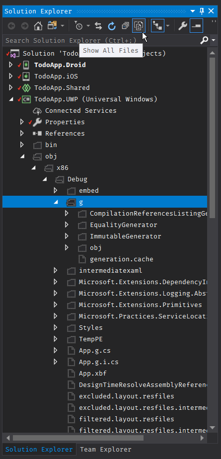
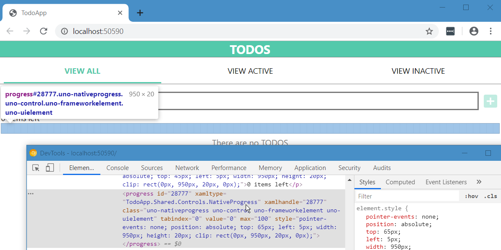
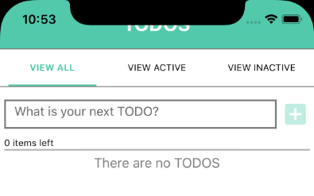
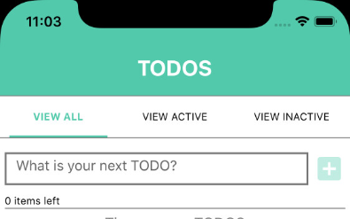

# Create rich responsive UIs

## 📖 Overview

Until recently, all Windows 10 XAML platform controls were tightly-coupled to the version of the OS run by the user. This meant fixing any bugs related to platform controls would require an update to the user's entire OS.

The [WinUI](https://aka.ms/winui) library changes this by decoupling the platform controls from the OS and ships independently and in the open on GitHub. With the upcoming WinUI v3.0, the majority of the platform controls will be open-sourced and available to be updated separately from Windows 10. This also allows your app to take fixes for controls while still running on an older OS version and not requiring the user to update their machine to get a control bug fix.

The Uno Platform aggressively fast-follows the Microsoft Windows and Microsoft WinUI roadmap. As Microsoft adds new controls and public APIs, they will be added to the Uno Platform either by the team or via community contributions.

## 💡 XAML Overview

This workshop assumes pre-existing knowledge of XAML, and if you are unfamiliar with the topic, then there's a [tons of knowledge available from Microsoft](https://docs.microsoft.com/en-us/windows/uwp/xaml-platform/xaml-overview).

## 💡 XAML with Uno

If you're an existing UWP XAML developer, you should feel right at home. Uno strives to make sure your existing XAML should just work. Just make sure you're developing a responsive application that works at multiple screen resolutions. Then validate periodically that all your features work in the iOS, Android, and WebAssembly heads of your Uno project.

There can be times when certain features aren't yet supported by Uno OR that you want to tailor an experience for a specific platform. In these cases, you can use Conditional XAML to allow you to keep the majority of your application the same, but filter out or change bits and pieces for specific platforms.

```xml
<ResourceDictionary xmlns="http://schemas.microsoft.com/winfx/2006/xaml/presentation"
                    xmlns:x="http://schemas.microsoft.com/winfx/2006/xaml"
                    xmlns:local="using:Uno.AzureDevOps.Views.Controls"
                    xmlns:mc="http://schemas.openxmlformats.org/markup-compatibility/2006"
                    xmlns:ios="http://uno.ui/ios"
                    xmlns:android="http://uno.ui/android"
                    xmlns:win="http://schemas.microsoft.com/winfx/2006/xaml/presentation"
                    mc:Ignorable="ios android">

    <ios:Style x:Key="NativeDefaultFrame"
               TargetType="Frame">
        <Setter Property="Template">
            <Setter.Value>
                <ControlTemplate TargetType="Frame">
                    <NativeFramePresenter Background="{TemplateBinding Background}" />
                </ControlTemplate>
            </Setter.Value>
        </Setter>
    </ios:Style>

    <android:Style x:Key="NativeDefaultFrame"
                   TargetType="Frame">
        <Setter Property="Template">
            <Setter.Value>
                <ControlTemplate TargetType="Frame">
                    <NativeFramePresenter Background="{TemplateBinding Background}" />
                </ControlTemplate>
            </Setter.Value>
        </Setter>
    </android:Style>

```

There are two code layout techniques that can be used to implement platform-specific code with the Uno Platform:

1. Place platform-specific code in a file that is only included in the desired `platform head`.
2. Use conditionals within a file within the `shared project` to conditionally implement platform-specific code.

In Visual Studio, a `shared project` is just a list of files. Referencing a `shared project` in an ordinary `.csproj` project causes those files to be included in the project. They're treated in exactly the same way as the files inside the project.

The Uno Platform provides you with two techniques to conditionally implement platform-specific code within a shared project:

1. [Platform-specific C# code in Uno][platform-specific-csharp].
2. [Platform-specific XAML markup in Uno][platform-specific-xaml].

## 💡 ValueConverters

XAML allows us to bind our data model to our view easily. However, the type of data value the view is expecting sometimes doesn't match the type of data in our model.

Rather than having to re-work our model, we can create a helper value converter in order to transform the data coming from the model into a type the view can understand.

To do this, we just simply create a class that implements the `IValueConverter` interface.

```csharp
using System;
using TodoApp.Shared.Models;
using Windows.UI.Xaml.Data;

namespace TodoApp.Shared.Converters
{
    public class FromStateItemsRemainingToPluralConverter : IValueConverter
    {
        public object Convert(object value, Type targetType, object parameter, string language)
        {
            if (value is State state)
            {
                var amountRemaining = state.RemainingTodos;
                return amountRemaining == 1 ? $"{amountRemaining} item left" : $"{amountRemaining} items left";
            }

            return null;
        }

        public object ConvertBack(object value, Type targetType, object parameter, string language)
        {
            throw new NotSupportedException();
        }
    }
}
```

In our page or application resources, we need to instantiate our converter so we can access it as a resource from our XAML bindings:

```xml
<converters:FromStateItemsRemainingToPluralConverter x:Key="FromStateItemsRemainingToPluralConverter" />
```

Now, we can use this converter in our binding within our XAML:

```xml
<TextBlock Text="{Binding State, Converter={StaticResource FromStateItemsRemainingToPluralConverter}}"
        Grid.Row="1"
        Padding="0,5,0,0"
        VerticalAlignment="Center" />
```

This will take our `State` variable from our model and pass it into our converter, which will then return some text for our TextBlock's `Text` property to consume.

## 💡 Debugging XAML

Enabling `Show All Files` will show the output from the Uno code generator and UWP XAML code generators.



By adding the `FeatureConfiguration.UIElement.AssignDOMXamlName = true;` into the _Program.cs_ file of your WebAssembly application (Wasm head), you will see the XAML names directly in the DOM by using the browser F12 tools.  Make sure to update the namespaces to include `using Uno.UI`;

```xml
using Uno.UI;
using Windows.UI.Xaml;

namespace TodoApp.Wasm
{
    public class Program
    {
        private static App _app;

        static int Main(string[] args)
        {
            FeatureConfiguration.UIElement.AssignDOMXamlName = true;
            Application.Start(_ => _app = new App());

            return 0;
        }
    }
}
```




## 🎯 Implement the user interface

You won't need to implement the datastore or model the entities, that has been done for you.

1. [ ] Review [TodoApp.Shared/ViewModels/MainPageViewModel.cs][src-viewmodel]
2. [ ] Implement [TodoApp/TodoApp.Shared/*.xaml][src-xaml]
3. [ ] Implement [TodoApp/TodoApp.Shared/*.xaml.cs][src-xaml-cs]

## 🎯 Use `VisualBoundsPadding` to manage the notch

If you run the app on an iPhone X, You'll see something like this:



As you can see, the **TODOS** header is placed under the device notch.

To fix this problem, Uno offers you a nice tool called the `VisualBoundsPadding`. The goal of this tool is to add padding to content you don't want to be altered by the notch.

1. Add the namespace declaration `xmlns:toolkit="using:Uno.UI.Toolkit"` to your XAML file
2. Add `toolkit:VisibleBoundsPadding.PaddingMask="Top"` to your _Header_ `<Grid>`
3. Add `toolkit:VisibleBoundsPadding.PaddingMask="Left,Right"` to your _Content_ `<Grid>`

The result will look like this and will follow the requirement of the platform vendor:



Finally, add a reference to the `Uno.UI` package in the UWP project to provide a blank implementation of the `VisibleBoundsPadding` service. Alternatively, you could use the `not_win` [conditional XAML compilation prefix][platform-specific-xaml] to exclude `VisibleBoundsPadding` from the UWP head.

## 📚 Additional Reading Material

- [VisibleBoundsPadding behavior][docs-visualboundspadding]
- https://medium.com/@unoplatform/talkin-bout-my-generation-how-the-uno-platform-generates-code-part-1-under-the-hood-7664d83c4f90
- https://platform.uno/docs/articles/implemented/windows-ui-xaml-controls-commandbar.html
- https://platform.uno/docs/articles/controls/CommandBar.html

## ⏭️ What's next

In [the next module][next-module] you'll learn about the next philosophical tenant — `Native intercompatibility` and create platform native controls then intermix them with WinUI/UWP XAML.

<!-- in-line links -->
[uno-platform]: https://platform.uno/

[previous-module]: ../03-Let-views-do-views/README.md
[next-module]: ../05-Native-intercompatibility/README.md

[philosophy-of-uno]: https://platform.uno/docs/articles/concepts/overview/philosophy-of-uno.html

[todomvc]: http://todomvc.com/

[src-xaml]: TodoApp/TodoApp.Shared/MainPage.xaml
[src-xaml-cs]: TodoApp/TodoApp.Shared/MainPage.xaml.cs
[src-viewmodel]: TodoApp/TodoApp.Shared/ViewModels/MainPageViewModel.cs


[platform-specific-csharp]: https://platform.uno/docs/articles/platform-specific-csharp.html
[platform-specific-xaml]: https://platform.uno/docs/articles/platform-specific-xaml.html

[docs-visualboundspadding]: https://github.com/unoplatform/uno/blob/master/doc/articles/features/VisibleBoundsPadding.md
