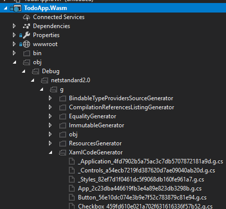

# Native intercompatibility

## 📖 Overview

The [Uno Platform][uno-platform] allows you to reuse views and business logic across platforms. Sometimes though you may want to write different code per platform, either because you need to access platform-specific native APIs and 3rd-party libraries, or because you want your app to look and behave differently depending on the platform.

In this module, you'll discover the platform-specific escape hatches within the Uno Platform and build a custom control to learn how a different native control can be used on a per-platform basis.

## 💡 What happens when you compile

With Roslyn, Microsoft open-sourced the C# compiler, but they also exposed a powerful API for code analysis. Roslyn provides easy access to all the syntactic and semantic information that the compiler possesses. The folks behind Uno created a [source generator][source-generator] that leverages this power for code generation and, like the Uno platform, it's free and open-source.

At compile time, there's four main things under the hood that Uno does:

- Parses XAML files and generates C# code to create the information needed to build your applications visual tree.
- Generation of [dependency objects](https://github.com/unoplatform/uno/blob/master/src/SourceGenerators/Uno.UI.SourceGenerators/DependencyObject/DependencyObjectGenerator.cs) that are optimised for static type-checking where possible.
- Generation of [native constructors for iOS and Android](https://github.com/unoplatform/uno/blob/master/src/SourceGenerators/Uno.UI.SourceGenerators/NativeCtor/NativeCtorsGenerator.cs).
- Generation of [Localizable.strings (iOS) and Strings.xml (Android)](https://github.com/unoplatform/uno/blob/master/src/SourceGenerators/Uno.UI.Tasks/ResourcesGenerator/ResourcesGenerationTask.cs) files from `.resw` resources.

Inside of the [source generator][source-generator] you'll find an msbuild task that allows you to easily add generated code based on Roslyn's analysis of your application. As the generator has a full set of semantic information from Roslyn, it can do this in a smart way. This might be partial class definitions which augment existing types, or it might be entirely new classes. For instance, if the source generator detects that the class is a view type, the source generator adds methods to update binding information when the view is loaded or unloaded.

If you are curious to see files generated from XAML, you should click on _View all files_ and check under the `obj`/ [config] / [platform] / `g` / `XamlCodeGenerator`. Each generator is getting a separate folder under `g`.



### 💡 DependencyObject is a interface with a supplied implementation

Part of the power of Uno on Android and iOS is the ability to easily mix UWP view types with purely native views. This is possible because, in Uno, all views inherit from the native base view type.

- On Android this means [View](https://developer.android.com/reference/android/view/View).
- On iOS this means [UIView](https://developer.apple.com/documentation/uikit/uiview).

This however posed a challenge for reproducing UWP's inheritance hierarchy as `UIElement` is the primitive view type in UWP, which derives from the `DependencyObject` class which is the base class for anything that has `DependencyProperties`, that is, anything that supports databinding such as views, as well as some non-view framework types like [Transforms](https://docs.microsoft.com/en-us/windows/uwp/design/layout/transforms) and [Brushes](https://docs.microsoft.com/en-us/windows/uwp/design/style/brushes).

Since Uno can't change the design of the iOS or Android frameworks, Uno chose to make `DependencyObject` an [interface](https://docs.microsoft.com/en-us/dotnet/csharp/programming-guide/interfaces/index) with an implementation that is supplied by code generation. This design decision allows an Uno `FrameworkElement` to be a `UIView` and at the same time to be a `DependencyObject`.

Most statically-typed languages, except C++, don't permit multiple base classes on account of the added complexity it brings, a.k.a. the ['diamond problem'](https://en.wikipedia.org/wiki/Multiple_inheritance#The_diamond_problem). In dynamically-typed languages, it's quite common to bolt on extra functionality to a class in a reusable way with [mixins](https://en.wikipedia.org/wiki/Mixin). As C# is a statically-typed language, it doesn't support mixins as a first-class language feature.

Uno can, however, generate code.

### 💡 Native Constructors are automatically provided

As views in Uno inherit directly from native views on Android/iOS, they need to have special constructors that are called [under-the-hood by Xamarin](https://docs.microsoft.com/en-us/xamarin/android/platform/java-integration/working-with-jni#binding-constructors). Writing these by hand would be tedius and particularly painful when porting existing UWP code, so Uno generates them for you automatically [if they don't already exist](https://github.com/unoplatform/uno/blob/ce1aa4d271fbcd30ff9b491f7f87fe28e24102ce/src/SourceGenerators/Uno.UI.SourceGenerators/NativeCtor/NativeCtorsGenerator.cs#L126).

## 💡 Platform-specific code in Uno

There are two code layout techniques that can be used to implement platform-specific code with the Uno Platform:

1. Place platform-specific code in a file which is only included in the desired `platform head`.
1. Use conditionals within a file within the `shared project` to conditionally implement platform-specific code.

In Visual Studio, a `shared project` is just a list of files. Referencing a `shared project` in an ordinary `.csproj` project causes those files to be included in the project. They're treated in exactly the same way as the files inside the project.

The Uno Platform provides you with two techniques to conditionally implement platform-specific code within a shared project:

1. [Platform-specific C# code in Uno][platform-specific-csharp].
1. [Platform-specific XAML markup in Uno][platform-specific-xaml].

## 💡 Platform-specific controls in Uno

Tag the platform-specific control with the `: DependencyObject` interface and the implementation of the interface will be automatically supplied by the [source generator][source-generator].

Below you'll find an example of how to wrap a `Android.Widget.ProgressBar` as a new control and usage of typical object oriented programming techniques to customise behavior of the new control:

```csharp
#if __ANDROID__
public partial class CustomControl : Android.Widget.ProgressBar, DependencyObject { }

// On Android, use Uno.UI.ContextHelper.Current to obtain Android.Content.Context
public CustomControl() : base(Uno.UI.ContextHelper.Current)
{
    Indeterminate = false;

    Min = 0;
    Progress = 50;
    Max = 100;
}
#endif
```

Some platform-specific controls (`UIKit.*`) only expose properties through methods therefore making them impossible to use from XAML. To improve bindability and to provide a way to make two-way binding possible the Uno Platform provides a growing number of `bindable controls` under the [Uno.UI.Controls][src-uno-ui-controls] namespace. If a native wrapper exists for your control, you should use it. If a native wrapper does not exist please create it and contribute it back to the project in a pull-request.

```csharp
#if __ANDROID__
public partial class YourControl : Uno.UI.Controls.BindableProgressBar { }

// On Android, use Uno.UI.ContextHelper.Current to obtain Android.Content.Context
public CustomControl() : base(Uno.UI.ContextHelper.Current)
{
    Indeterminate = false;

    Min = 0;
    Progress = 50;
    Max = 100;
}
#endif
```

## 🎯 Build the NativeProgress control

The implementation for iOS and Android has been done for you. You'll need to do the WebAssembly control.

```xml
<Page ...
    xmlns:controls="using:TodoApp.Shared.Controls">
    <controls:NativeProgress Value="{Binding Value}" />
</Page>
```

1. [ ] Review [TodoApp/TodoApp.Shared/*.xaml][src-xaml]
1. [ ] Review [TodoApp/TodoApp.Shared/*.xaml.cs][src-xaml-cs]
1. [ ] Review [TodoApp/TodoApp.SharedControls/NativeProgress.md][src-controls]
1. [ ] Review [TodoApp/TodoApp.SharedControls/NativeProgress.cs][src-controls]
1. [ ] Review [TodoApp/TodoApp.SharedControls/NativeProgress.Droid.cs][src-controls]
1. [ ] Review [TodoApp/TodoApp.SharedControls/NativeProgress.iOS.cs][src-controls]
1. [ ] Review [TodoApp/TodoApp.SharedControls/NativeProgress.UWP.cs][src-controls]
1. [ ] Implement [TodoApp/TodoApp.SharedControls/NativeProgress.WASM.cs][src-controls]

## 📚 Additional Reading Material

- [Platform-specific C# code in Uno][platform-specific-csharp].
- [Platform-specific XAML markup in Uno][platform-specific-xaml].
- [Bindable controls][src-uno-ui-controls].
- [Talkin’ ‘bout my generation: How the Uno Platform generates code, part 1][code-generation-blogpost-part1].
- [Talkin’ ‘bout my generation: How the Uno Platform generates code, part 2][code-generation-blogpost-part2].

## ⏭️ What's next

In [the next module][next-module] you'll learn about the internals of the Uno Platform code-base. The team has built in plenty of escape hatches that enables you to be autonomous without being dependant on pull-requests being merged. We hope that that this knowledge will enable you to become self-reliant, to not [push your pull-requests][dont-push-your-pull-requests] if you are ever caught in a jam and ultimately become a regular contributor to the open-source project. A growing open-source project is a healthy open-source project. 💖

<!-- in-line links -->
[uno-platform]: https://platform.uno/

[previous-module]: ../04-Create-rich-responsive-UIs/README.md
[next-module]: ../07-Working-with-Uno/README.md

[source-generator]: https://github.com/nventive/Uno.SourceGeneration

[philosophy-of-uno]: https://platform.uno/docs/articles/concepts/overview/philosophy-of-uno.html

[platform-specific-csharp]: https://platform.uno/docs/articles/platform-specific-csharp.html
[platform-specific-xaml]: https://platform.uno/docs/articles/platform-specific-xaml.html

[src-xaml]: TodoApp/TodoApp.Shared/MainPage.xaml
[src-xaml-cs]: TodoApp/TodoApp.Shared/MainPage.xaml.cs
[src-controls]: TodoApp/TodoApp.Shared/Controls

[src-uno-ui-controls]: https://github.com/unoplatform/uno/tree/master/src/Uno.UI/Controls

[code-generation-blogpost-part1]: https://platform.uno/talkin-bout-my-generation-how-the-uno-platform-generates-code-part-1%e2%80%8a-%e2%80%8aunder-the-hood/
[code-generation-blogpost-part2]: https://platform.uno/talkin-bout-my-generation-how-the-uno-platform-generates-code-part-2-under-the-hood/

[dont-push-your-pull-requests]: https://www.igvita.com/2011/12/19/dont-push-your-pull-requests/
